# 2. System Architecture

This document provides a comprehensive overview of the CrowdFUNding platform's system architecture, explaining how all components work together to deliver a seamless crowdfunding experience.

## High-Level Architecture Overview

The CrowdFUNding platform follows a modern multi-tier architecture with four main components. Each component is designed to be independently deployable while maintaining seamless integration with others.

## Component Architecture

This section describes the internal architecture of each component, explaining the design decisions and technologies used.

### 1. Frontend Architecture

The frontend is built with Next.js 16 using the App Router pattern, providing server-side rendering for SEO and fast initial page loads.

The following table summarizes the key architectural decisions in the frontend:

| Layer | Technology | Purpose |
|-------|------------|---------|
| **Framework** | Next.js 16 (App Router) | Server-side rendering, routing, API routes |
| **State Management** | React Query + Context | Server state caching, global app state |
| **Blockchain** | Wagmi + Viem | Type-safe contract interactions |
| **Authentication** | Privy | Social login + embedded wallets |
| **Styling** | TailwindCSS 4 | Utility-first responsive design |

### 2. Backend Architecture

The backend uses a layered architecture pattern, separating concerns between routes, controllers, services, and data access layers. It also serves as a caching layer to reduce direct blockchain queries.

```mermaid
flowchart TB
    subgraph API["🔷 API Layer"]
        Routes["Express Routes"]
        Middleware["Auth Middleware"]
    end

    subgraph Business["🔶 Business Layer"]
        VaultController["Vault Controller"]
        AuthController["Auth Controller"]
        SyncController["Sync Controller"]
        AchievementController["Achievement Controller"]
    end

    subgraph Data["🔵 Data Layer"]
        Models["Sequelize Models"]
        PonderClient["Ponder API Client"]
    end

    subgraph External["🌐 External"]
        PostgreSQL[(PostgreSQL)]
        Ponder["Ponder Indexer"]
        Blockchain["Base Sepolia"]
    end

    Routes --> Middleware
    Middleware --> Business
    Business --> Data
    Models --> PostgreSQL
    PonderClient --> Ponder
    SyncController --> PonderClient
```

The backend serves multiple critical functions as described in this table:

| Service | Responsibility | Key Features |
|---------|---------------|--------------|
| **REST API** | Serve frontend requests | CORS, rate limiting, validation |
| **Auth Service** | User authentication | Google OAuth, JWT tokens, sessions |
| **Sync Service** | Cache blockchain data | 30-second polling from Ponder |
| **Database** | Store off-chain data | User profiles, campaign metadata |

### 3. Smart Contract Architecture

The smart contracts follow a singleton pattern where one contract manages all campaigns, optimizing gas costs and simplifying event indexing.

Key design decisions for the smart contracts are summarized below:

| Pattern | Implementation | Benefit |
|---------|---------------|---------|
| **Singleton** | One Campaign.sol for all | Saves gas, centralized events |
| **Auto-Swap** | Built into donate() | UX simplification |
| **Unified Token** | All stored as IDRX | Simplified accounting |

### 4. Indexer Architecture

The Ponder indexer listens to blockchain events and maintains a queryable database, providing both GraphQL and REST APIs for data access.

```mermaid
flowchart TB
    subgraph Blockchain["⛓️ Blockchain Events"]
        CampaignCreated["CampaignCreated"]
        DonationReceived["DonationReceived"]
        FundWithdrawn["FundWithdrawn"]
        BadgeMinted["BadgeMinted"]
    end

    subgraph Handlers["📥 Event Handlers"]
        CampaignHandler["Campaign.ts"]
        BadgeHandler["Badge.ts"]
    end

    subgraph Database["💾 Database"]
        Campaigns["campaigns"]
        Donations["donations"]
        Withdrawals["withdrawals"]
        Badges["badges"]
    end

    subgraph APIs["🔌 APIs"]
        GraphQL["GraphQL Endpoint"]
        REST["REST Endpoints"]
    end

    Blockchain --> Handlers
    Handlers --> Database
    Database --> APIs
```

The indexer handles the following events and stores them in structured tables:

| Event | Handler | Stored Data |
|-------|---------|-------------|
| `CampaignCreated` | Insert campaign | id, name, owner, target |
| `DonationReceived` | Insert donation, update balance | donor, amount, timestamp |
| `FundWithdrawn` | Insert withdrawal, update balance | owner, amount |
| `BadgeMinted` | Insert badge | tokenId, owner, name |

---

## Data Flow Architecture

This section explains how data moves through the system during key operations.

### Campaign Creation Flow

When a user creates a campaign, data flows through multiple layers before being stored on the blockchain and cached locally.

### Donation Flow with Auto-Swap

Donations support multiple currencies (BASE, USDC, IDRX) with automatic conversion to IDRX. This simplifies the user experience while ensuring all campaigns receive funds in a stable, predictable currency.

---

## Communication Protocols

The platform uses different protocols optimized for each type of communication.

### Protocol Summary

This table describes the communication methods between each component:

| From | To | Protocol | Purpose |
|------|-----|----------|---------|
| Frontend | Blockchain | JSON-RPC (via Wagmi) | Contract calls, transactions |
| Frontend | Backend | REST (Axios) | User data, off-chain operations |
| Backend | Indexer | REST/GraphQL | Fetch indexed blockchain data |
| Indexer | Blockchain | WebSocket/RPC | Event subscription |
| Backend | PostgreSQL | TCP (pg driver) | Data persistence |

### API Endpoint Categories

The backend exposes the following REST API categories:

| Category | Base Path | Purpose |
|----------|-----------|---------|
| Authentication | `/crowdfunding/auth/*` | Login, logout, session |
| Campaigns | `/crowdfunding/vault/*` | CRUD operations |
| Contributions | `/crowdfunding/contribution/*` | Donation tracking |
| Achievements | `/crowdfunding/achievements/*` | Badge management |
| Sync | `/api/sync/*` | Data synchronization |

---

## Security Architecture

Security is implemented at every layer of the stack to protect user funds and data.

### Security Layers

```mermaid
flowchart TB
    subgraph Frontend["🌐 Frontend Security"]
        HTTPS["HTTPS Only"]
        CSP["Content Security Policy"]
        WalletAuth["Wallet Signatures"]
    end

    subgraph Backend["⚙️ Backend Security"]
        JWT["JWT Authentication"]
        RateLimit["Rate Limiting"]
        InputVal["Input Validation"]
        CORS["CORS Configuration"]
    end

    subgraph Blockchain["⛓️ Smart Contract Security"]
        Reentrancy["ReentrancyGuard"]
        SafeTransfer["SafeERC20"]
        OwnerCheck["Owner Validation"]
        Overflow["Overflow Protection"]
    end
```

The following table summarizes security measures at each layer:

| Layer | Threat | Mitigation |
|-------|--------|------------|
| **Frontend** | XSS, CSRF | CSP headers, secure cookies |
| **Backend** | SQL Injection | Parameterized queries |
| **Backend** | Unauthorized access | JWT + session validation |
| **Smart Contract** | Reentrancy | OpenZeppelin ReentrancyGuard |
| **Smart Contract** | Token theft | SafeERC20, owner checks |

---

## Scalability Considerations

The architecture is designed to scale horizontally at each layer:

| Component | Scaling Strategy |
|-----------|------------------|
| **Frontend** | Vercel Edge Functions, CDN |
| **Backend** | Horizontal pod scaling, load balancer |
| **Database** | PostgreSQL read replicas |
| **Indexer** | Multiple instances with different block ranges |
