# 3. Data Flow

This document provides an in-depth analysis of how data flows through the CrowdFUNding platform, covering all major operations from campaign creation to fund withdrawal.

## Data Layer Overview

The platform uses a three-tier data architecture to balance blockchain transparency with query performance. Each layer serves a specific purpose in the overall data flow.

```mermaid
flowchart TB
    subgraph Layer1["⛓️ Layer 1: Blockchain (Source of Truth)"]
        Contracts["Smart Contracts"]
        Events["Event Logs"]
    end

    subgraph Layer2["🔍 Layer 2: Indexer (Real-time Processing)"]
        Ponder["Ponder Indexer"]
        IndexerDB["Indexed Database"]
    end

    subgraph Layer3["💾 Layer 3: Backend Cache (Fast Queries)"]
        Backend["Express Backend"]
        PostgreSQL["PostgreSQL Cache"]
    end

    Contracts --> |"Emit Events"| Events
    Events --> |"Subscribe"| Ponder
    Ponder --> |"Process & Store"| IndexerDB
    Backend --> |"Poll Every 30s"| IndexerDB
    Backend --> |"Cache Data"| PostgreSQL
```



The following table explains the purpose and characteristics of each data layer:

| Layer | Technology | Purpose | Latency |
|-------|------------|---------|---------|
| **Blockchain** | Base Sepolia | Permanent storage, source of truth | ~2 seconds |
| **Indexer** | Ponder + SQLite/PostgreSQL | Real-time event processing | ~5 seconds |
| **Backend Cache** | PostgreSQL | Fast queries, join operations | ~50 ms |

---

## Campaign Data Flow

### Campaign Creation

When a creator submits a new campaign, the data flows through the entire stack to ensure both on-chain permanence and fast queryability.


**Key Points:**
- On-chain data includes: `name`, `creatorName`, `targetAmount`, `owner`, `creationTime`
- Off-chain data (description, images) is stored directly in PostgreSQL via backend API
- The campaign becomes queryable via backend API within 30 seconds

### Campaign Data Structure

The campaign data is represented differently at each layer. This table shows the mapping:

| Field | Blockchain | Indexer | Backend Cache |
|-------|------------|---------|---------------|
| `id` | uint256 | integer (PK) | integer (PK) |
| `name` | string | text | varchar(255) |
| `creatorName` | string | text | varchar(255) |
| `owner` | address | hex | varchar(42) |
| `balance` | uint256 | bigint | decimal(78,0) |
| `targetAmount` | uint256 | bigint | decimal(78,0) |
| `creationTime` | uint256 | bigint | timestamp |
| `description` | ❌ | ❌ | text |
| `imageUrl` | ❌ | ❌ | varchar(500) |

---

## Donation Data Flow

### Multi-Currency Donation with Auto-Swap

Users can donate using BASE (native token), USDC, or IDRX. When donating with non-IDRX currencies, the system automatically swaps to IDRX to ensure consistent campaign accounting.


### Token Swap Exchange Rates

The MockSwap contract maintains exchange rates for converting between tokens. These rates are defined in the contract's storage:

| Input | Output per 1 ETH | Calculation |
|-------|------------------|-------------|
| BASE (ETH) | 268,400 IDRX | Direct rate to IDRX |
| USDC | 16,775 IDRX per USDC | USDC → ETH equivalent → IDRX |
| IDRX | 1 IDRX | No swap needed |

### Donation Record Structure

Each donation creates a record in the indexer with the following structure:


---

## Withdrawal Data Flow

### Fund Withdrawal Process

Campaign owners can withdraw accumulated IDRX funds at any time. The contract validates ownership before transferring tokens.


**Security Checks:**
1. **Ownership**: Only the campaign creator can withdraw
2. **Balance**: Cannot withdraw more than available balance
3. **Reentrancy**: Protected by ReentrancyGuard modifier

---

## Authentication Data Flow

### User Authentication Options

The platform supports multiple authentication methods to accommodate both crypto-native and traditional users.


### Authentication Flow (Google OAuth)

For users who prefer social login, Google OAuth provides a familiar authentication experience while still creating a blockchain-ready account.


---

## Indexer Event Processing

### Real-time Event Handling

The Ponder indexer subscribes to blockchain events and processes them in real-time. Each event type has a dedicated handler that transforms the event data into database records.

```mermaid
flowchart TB
    subgraph Blockchain["⛓️ Blockchain Events"]
        E1["CampaignCreated"]
        E2["DonationReceived"]
        E3["FundWithdrawn"]
        E4["BadgeMinted"]
    end

    subgraph Handlers["📥 Event Handlers"]
        H1["handleCampaignCreated"]
        H2["handleDonationReceived"]
        H3["handleFundWithdrawn"]
        H4["handleBadgeMinted"]
    end

    subgraph Operations["💾 Database Operations"]
        O1["INSERT campaigns"]
        O2["INSERT donations\nUPDATE campaigns.balance"]
        O3["INSERT withdrawals\nUPDATE campaigns.balance"]
        O4["INSERT badges"]
    end

    E1 --> H1 --> O1
    E2 --> H2 --> O2
    E3 --> H3 --> O3
    E4 --> H4 --> O4
```



### Event Handler Example

This code snippet shows how the DonationReceived event is processed:

```typescript
ponder.on("Campaign:DonationReceived", async ({ event, context }) => {
  const { db } = context;
  
  // Create unique ID from transaction hash and log index
  const donationId = `${event.transaction.hash}-${event.log.logIndex}`;
  
  // Insert donation record
  await db.donations.insert({
    id: donationId,
    campaignId: Number(event.args.id),
    donor: event.args.donor,
    amount: event.args.amount,
    blockNumber: event.block.number,
    timestamp: event.block.timestamp,
    transactionHash: event.transaction.hash,
  });
  
  // Update campaign balance
  await db.campaigns.update({
    id: Number(event.args.id),
    balance: (prev) => prev.balance + event.args.amount,
  });
});
```

---

## Backend Sync Process

### Automatic Data Synchronization

The backend runs an auto-sync service that periodically fetches data from the Ponder indexer and updates the PostgreSQL cache.


### Why Cache in PostgreSQL?

The backend maintains a PostgreSQL cache for several important reasons:

| Reason | Explanation |
|--------|-------------|
| **Query Performance** | Complex JOINs are faster on PostgreSQL than on indexed data |
| **Off-chain Data** | Store descriptions, images, and user preferences |
| **Data Enrichment** | Combine on-chain and off-chain data |
| **Reliability** | Serve data even if Ponder is temporarily unavailable |

---

## API Data Flow

### REST API Request/Response Flow

When the frontend makes an API request, the data flows through multiple backend layers before returning to the client.


### API Response Format

All API responses follow a consistent format to simplify frontend handling:

```json
{
  "success": true,
  "data": {
    "campaigns": [
      {
        "id": 1,
        "name": "Save the Rainforest",
        "creatorName": "Green Foundation",
        "balance": "45000000",
        "targetAmount": "100000000",
        "owner": "0x1234...5678",
        "creationTime": "1706577600"
      }
    ]
  },
  "meta": {
    "total": 42,
    "page": 1,
    "limit": 10
  }
}
```

---

## Badge Minting Data Flow

### Achievement Badge Creation

When a user earns an achievement (e.g., first donation), the backend triggers a badge mint on the blockchain.


---

## Summary: Complete Data Journey

This diagram shows the complete journey of data through the CrowdFUNding platform, from user action to final storage.

```mermaid
flowchart LR
    subgraph UserActions["👤 User Actions"]
        Create["Create Campaign"]
        Donate["Make Donation"]
        Withdraw["Withdraw Funds"]
    end

    subgraph OnChain["⛓️ On-Chain"]
        SC["Smart Contracts"]
        Events["Event Logs"]
    end

    subgraph OffChain["☁️ Off-Chain"]
        Indexer["Ponder Indexer"]
        Backend["Express Backend"]
        DB["PostgreSQL"]
    end

    subgraph Clients["📱 Clients"]
        Web["Web App"]
        API["API Consumers"]
    end

    UserActions --> SC
    SC --> Events
    Events --> Indexer
    Indexer --> Backend
    Backend --> DB
    DB --> Clients
```


