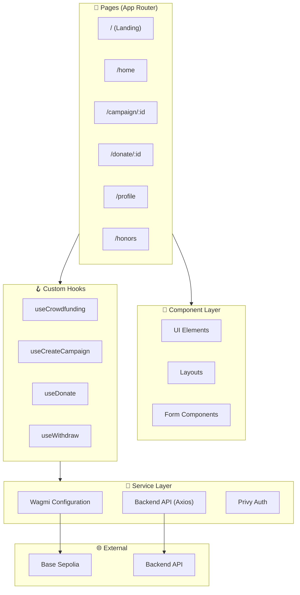
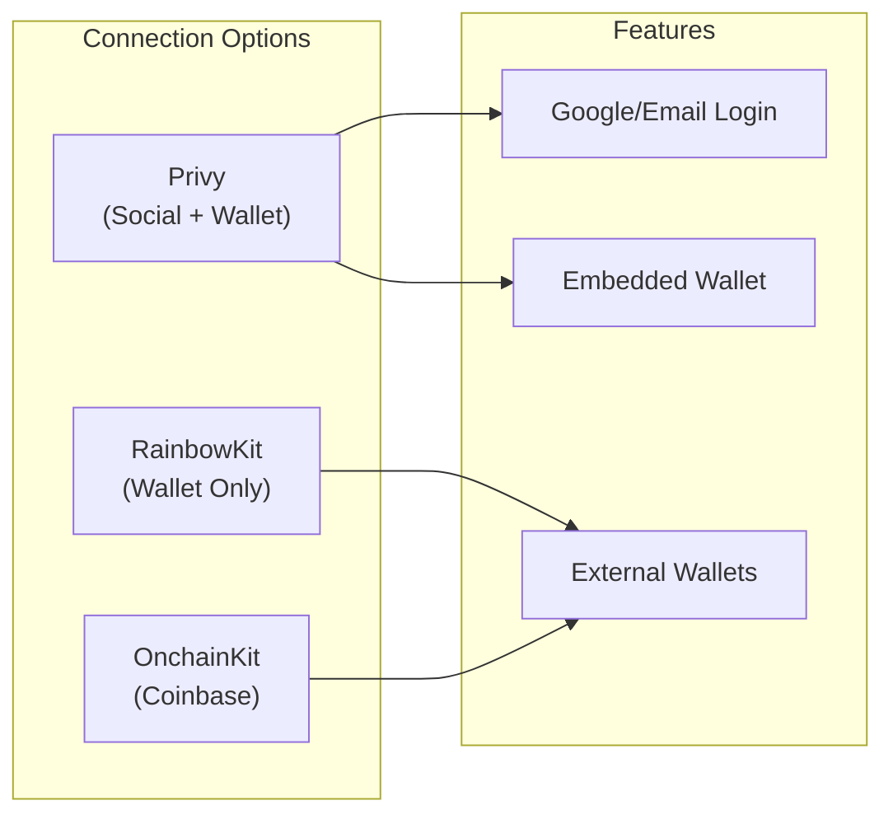

# 3. Frontend Guide

This guide provides comprehensive instructions for setting up and running the CrowdFUNding frontend application, including its architecture and key components.

## Overview

The frontend is a **Next.js 16** application built with React 19 and TypeScript. It provides the user interface for the CrowdFUNding platform, handling wallet connections, campaign browsing, donations, and achievement displays.

**Key Features:**
- ⚡ Server-side rendering with App Router
- 🔐 Multiple wallet connection options (Privy, RainbowKit, OnchainKit)
- 🎨 Beautiful UI with TailwindCSS 4 and Framer Motion
- 📱 Farcaster Miniapp integration
- 🔗 Direct blockchain interaction via wagmi/viem

## Architecture

The frontend follows a modular architecture with clear separation between pages, components, hooks, and utilities.



### Key Architectural Decisions

The following table explains the major architectural choices:

| Decision | Implementation | Benefit |
|----------|---------------|---------|
| **App Router** | Next.js 16 App Directory | Server components, streaming |
| **Multi-Wallet** | Privy + RainbowKit | Support all user types |
| **React Query** | TanStack Query | Smart caching, background refresh |
| **Type-Safe Contracts** | Wagmi + Viem | Compile-time error detection |

## Prerequisites

Before setting up the frontend, ensure you have:

- **Node.js** v18 or higher
- **npm**, **yarn**, or **pnpm** (yarn recommended)

## Project Structure

The frontend uses a modular structure with the App Router pattern:

```
├── app/                          # Next.js App Router
│   ├── (auth)/                   # Authentication route group
│   │   └── login/
│   ├── (main)/                   # Main app with navigation
│   │   ├── campaign/
│   │   ├── history/
│   │   ├── home/
│   │   ├── honors/
│   │   └── profile/
│   ├── (main-no-nav)/            # Pages without navigation
│   │   ├── donate/
│   │   └── campaign-detail/
│   ├── page.tsx                  # Landing page
│   └── layout.tsx                # Root layout
├── src/
│   ├── components/               # Reusable UI components
│   │   ├── Element/              # Buttons, cards, inputs
│   │   ├── Layout/               # Page layouts, navigation
│   │   └── Contexts/             # React context providers
│   ├── hooks/                    # Custom React hooks
│   ├── modules/                  # Page-specific modules
│   ├── utils/
│   │   ├── abi/                  # Contract ABIs
│   │   ├── api/                  # Backend API clients
│   │   ├── contracts/            # Contract addresses
│   │   └── wagmi/                # Wagmi configuration
│   └── styles/                   # Global CSS styles
├── public/                       # Static assets
├── next.config.ts                # Next.js configuration
└── tailwind.config.ts            # TailwindCSS configuration
```

## Component Architecture

The frontend uses a layered component architecture for maximum reusability:

```mermaid
flowchart LR
    subgraph Atoms["Atoms"]
        Button["Button"]
        Input["Input"]
        Badge["Badge"]
    end

    subgraph Molecules["Molecules"]
        Card["CampaignCard"]
        Form["DonationForm"]
        Progress["ProgressBar"]
    end

    subgraph Organisms["Organisms"]
        Header["Header"]
        CampaignList["CampaignList"]
        DonationModal["DonationModal"]
    end

    subgraph Templates["Templates/Pages"]
        HomePage["Home Page"]
        CampaignPage["Campaign Page"]
        DonatePage["Donate Page"]
    end

    Atoms --> Molecules --> Organisms --> Templates
```



## Environment Setup

Create a `.env.local` file in the project root:

```env
# ============================
# Wallet Connection
# ============================
NEXT_PUBLIC_WALLET_CONNECT_ID=your_walletconnect_project_id
NEXT_PUBLIC_PRIVY_APP_ID=your_privy_app_id
NEXT_PUBLIC_ONCHAINKIT_API_KEY=your_onchainkit_api_key

# ============================
# Blockchain (RPC)
# ============================
NEXT_PUBLIC_ALCHEMY_KEY=your_alchemy_api_key

# ============================
# Smart Contract Addresses
# ============================
NEXT_PUBLIC_CAMPAIGN_ADDRESS=0x44e87aa98d721Dbcf368690bF5aAb1F3dD944dA9
NEXT_PUBLIC_BADGE_ADDRESS=0xaE32Df9Fb677aE68C5A1F956761a42e269Ebdc99
NEXT_PUBLIC_MOCK_SWAP_ADDRESS=0x554366984fD2f5D82c753F91357d80c29F887F17
NEXT_PUBLIC_IDRX_ADDRESS=0x387551ac55Bb6949d44715D07880f8c6260934B6
NEXT_PUBLIC_USDC_ADDRESS=0x1b929eB40670aA4e0D757d45cA9aea2311a25a97

# ============================
# Backend API
# ============================
NEXT_PUBLIC_API_URL=http://localhost:3300

# ============================
# Farcaster (Optional)
# ============================
NEXT_PUBLIC_FARCASTER_FRAME_URL=https://frames.example.com
```

### How to Get Environment Keys

The following table provides instructions for obtaining each required key:

| Variable | How to Obtain |
|----------|---------------|
| `NEXT_PUBLIC_WALLET_CONNECT_ID` | [WalletConnect Cloud](https://cloud.walletconnect.com) → Create Project |
| `NEXT_PUBLIC_PRIVY_APP_ID` | [Privy Dashboard](https://privy.io) → Create App |
| `NEXT_PUBLIC_ONCHAINKIT_API_KEY` | [Coinbase CDP](https://portal.cdp.coinbase.com) → Create API Key |
| `NEXT_PUBLIC_ALCHEMY_KEY` | [Alchemy Dashboard](https://alchemy.com) → Create Base Sepolia App |

## Installation

### Step 1: Install Dependencies

```bash
# Using yarn (recommended)
yarn install

# Using npm
npm install
```

### Step 2: Start Development Server

```bash
yarn dev
# or
npm run dev
```

The application will start at `http://localhost:3000`

## Page Routes

The application uses Next.js App Router with route groups for different layouts:

| Route | Layout | Description |
|-------|--------|-------------|
| `/` | Minimal | Landing page |
| `/home` | Main (with nav) | Campaign discovery |
| `/campaign/:id` | Main (with nav) | Campaign detail |
| `/donate/:id` | No nav | Donation flow |
| `/history` | Main (with nav) | User donation history |
| `/profile` | Main (with nav) | User settings |
| `/honors` | Main (with nav) | Achievement badges |
| `/login` | Auth | Authentication page |

## Key Hooks

The frontend provides custom hooks that abstract blockchain interactions. These hooks handle wallet connections, contract calls, and state management.

### useCrowdfunding

This hook fetches campaign data from both the blockchain and backend API:

```tsx
import { useCrowdfunding } from '@/hooks/useCrowdfunding';

const CampaignList = () => {
  const { campaigns, isLoading, error } = useCrowdfunding();

  if (isLoading) return <Spinner />;
  if (error) return <Error message={error.message} />;

  return (
    <div className="grid grid-cols-3 gap-4">
      {campaigns.map(campaign => (
        <CampaignCard key={campaign.id} campaign={campaign} />
      ))}
    </div>
  );
};
```

### useCreateCampaign

This hook handles the campaign creation flow including transaction signing:

```tsx
import { useCreateCampaign } from '@/hooks/useCreateCampaign';

const CreateCampaignForm = () => {
  const { createCampaign, isLoading, error } = useCreateCampaign();

  const handleSubmit = async (data) => {
    await createCampaign({
      name: data.name,
      creatorName: data.creatorName,
      targetAmount: parseUnits(data.target, 2) // IDRX has 2 decimals
    });
  };

  return <form onSubmit={handleSubmit}>...</form>;
};
```

### useDonate

This hook handles donations with support for multiple currencies:

```tsx
import { useDonate } from '@/hooks/useDonate';

const DonationForm = ({ campaignId }) => {
  const { donate, donateWithToken, isLoading } = useDonate();

  // Donate with BASE (native token)
  const handleNativeDonation = async (amount) => {
    await donate(campaignId, parseEther(amount));
  };

  // Donate with ERC20 (USDC or IDRX)
  const handleTokenDonation = async (amount, tokenAddress) => {
    await donateWithToken(campaignId, amount, tokenAddress);
  };
};
```

### useWithdraw

This hook allows campaign owners to withdraw accumulated funds:

```tsx
import { useWithdraw } from '@/hooks/useWithdraw';

const WithdrawButton = ({ campaignId, amount }) => {
  const { withdraw, isLoading } = useWithdraw();

  const handleWithdraw = async () => {
    await withdraw(campaignId, amount);
  };

  return (
    <button onClick={handleWithdraw} disabled={isLoading}>
      {isLoading ? 'Processing...' : 'Withdraw Funds'}
    </button>
  );
};
```

## Wallet Integration

The frontend supports multiple wallet connection methods to accommodate different user preferences:



### Wallet Connection Example

```tsx
// Using Privy (supports social login + wallets)
import { usePrivy } from '@privy-io/react-auth';

const ConnectButton = () => {
  const { login, logout, user, ready } = usePrivy();

  if (!ready) return <Spinner />;
  
  if (user) {
    return (
      <button onClick={logout}>
        Disconnect ({user.wallet?.address?.slice(0, 6)}...)
      </button>
    );
  }

  return <button onClick={login}>Connect Wallet</button>;
};
```

## Styling

The frontend uses TailwindCSS 4 for styling with custom design tokens:

```tsx
// Example component with Tailwind
const CampaignCard = ({ campaign }) => (
  <div className="bg-gradient-to-r from-purple-600 to-blue-500 rounded-xl p-6 shadow-lg hover:shadow-xl transition-shadow">
    <h2 className="text-2xl font-bold text-white">{campaign.name}</h2>
    <p className="text-white/80 mt-2">{campaign.creatorName}</p>
    <ProgressBar value={campaign.balance} max={campaign.targetAmount} />
  </div>
);
```

### Animations with Framer Motion

```tsx
import { motion } from 'framer-motion';

const AnimatedCard = ({ children }) => (
  <motion.div
    initial={{ opacity: 0, y: 20 }}
    animate={{ opacity: 1, y: 0 }}
    transition={{ duration: 0.5 }}
    whileHover={{ scale: 1.02 }}
  >
    {children}
  </motion.div>
);
```

## Building for Production

### Create Production Build

```bash
yarn build
# or
npm run build
```

### Start Production Server

```bash
yarn start
# or
npm start
```

## Deployment

### Vercel (Recommended)

Vercel provides the best experience for Next.js applications:

1. Push your code to GitHub
2. Connect repository to [Vercel](https://vercel.com)
3. Set environment variables in the Vercel dashboard
4. Deploy!

Or use the CLI:
```bash
vercel --prod
```

### Other Platforms

The app can be deployed to any platform supporting Next.js:
- Netlify
- Railway
- AWS Amplify
- Self-hosted with Node.js

## Troubleshooting

### Wallet Connection Failed

**Error:** `WalletConnect failed to initialize`

**Solution:** Ensure `NEXT_PUBLIC_WALLET_CONNECT_ID` is correctly set in `.env.local`.

### Contract Interaction Failed

**Error:** `Cannot read properties of undefined (reading 'write')`

**Solution:** 
1. Verify contract addresses in `.env.local`
2. Ensure wallet is connected to Base Sepolia (chainId: 84532)

### API Request Failed

**Error:** `Network Error`

**Solution:** 
1. Ensure backend is running at `NEXT_PUBLIC_API_URL`
2. Check CORS settings on backend

### TailwindCSS Not Working

**Solution:** Ensure PostCSS is configured correctly:

```js
// postcss.config.mjs
export default {
  plugins: {
    "@tailwindcss/postcss": {},
    autoprefixer: {},
  },
};
```

## Development Tips

### Switch Networks Easily

Force users to switch to Base Sepolia:

```tsx
import { useSwitchChain } from 'wagmi';
import { baseSepolia } from 'wagmi/chains';

const NetworkSwitcher = () => {
  const { switchChain } = useSwitchChain();

  return (
    <button onClick={() => switchChain({ chainId: baseSepolia.id })}>
      Switch to Base Sepolia
    </button>
  );
};
```

### Debug Contract Calls

Enable detailed logging for wagmi:

```tsx
import { useContractWrite } from 'wagmi';

const { writeAsync, error, status } = useContractWrite({
  // config...
});

console.log('Transaction status:', status);
if (error) console.error('Contract error:', error);
```
