# 8. How CrowdFUNding Works

This document provides a comprehensive explanation of how the CrowdFUNding platform operates, from user registration to fund withdrawal.

## Platform Overview

CrowdFUNding is a **gamified crowdfunding platform** built on **Base blockchain** that enables transparent, borderless fundraising with NFT achievements.

The platform serves two main user types:
- 🎯 **Campaign Creators** who raise funds for their projects
- 💰 **Donors** who contribute in multiple currencies (BASE, USDC, IDRX)

The following diagram shows the high-level interaction between users and the platform:

---

## Step-by-Step Process

### Step 1: User Onboarding

Users can join CrowdFUNding through multiple methods, accommodating both crypto-native and non-crypto users. The platform prioritizes accessibility without sacrificing security.

**Key Benefits:**
- **Wallet First**: For crypto-native users who already have wallets
- **Social First**: For newcomers who don't want to manage seed phrases
- **Farcaster**: For social-first users who value community integration

### Step 2: Creating a Campaign

Campaign creators start their fundraising journey by submitting a campaign form. The data is split between on-chain and off-chain storage for optimal gas efficiency.

```mermaid
sequenceDiagram
    participant Creator
    participant Frontend
    participant Wallet
    participant Contract as Campaign.sol
    participant Backend
    participant DB as PostgreSQL

    Note over Creator,Frontend: Fill campaign form
    Creator->>Frontend: Enter name, target, description
    Frontend->>Frontend: Validate input
    
    Note over Frontend,Contract: On-chain transaction
    Frontend->>Wallet: Request signature
    Wallet->>Contract: createCampaign(name, creatorName, target)
    Contract->>Contract: Store CampaignStruct
    Contract->>Contract: Emit CampaignCreated event
    
    Note over Frontend,DB: Store off-chain data
    Frontend->>Backend: POST description, images
    Backend->>DB: Insert campaign metadata
    
    Note over Contract,Creator: Confirmation
    Contract-->>Frontend: Transaction confirmed
    Frontend->>Creator: Campaign is live! 🎉
```

**On-chain data**: name, creatorName, targetAmount, owner, creationTime  
**Off-chain data**: description, images, category, social links

### Step 3: Making a Donation

The donation system supports multiple currencies with automatic conversion to IDRX. This ensures campaign creators always receive a stable, predictable currency while donors can use their preferred token.

**Why unified currency?**
- ✅ Predictable amounts for creators
- ✅ Simplified withdrawal process
- ✅ Easy off-ramp to Indonesian Rupiah

The following table shows the exchange rates used for conversion:

| Input Currency | Output (per 1 input) | Rate Source |
|----------------|---------------------|-------------|
| 1 BASE (ETH) | 268,400 IDRX | MockSwap contract |
| 1 USDC | 16,775 IDRX | MockSwap contract |
| 1 IDRX | 1 IDRX | No conversion |

### Step 4: Earning Achievements

The gamification system rewards donors with NFT badges for their contributions. This adds a fun, collectible element to the crowdfunding experience.

```mermaid
flowchart LR
    subgraph Milestones["🎯 Milestones"]
        M1["First Donation"]
        M2["Donate ≥ 100K IDRX"]
        M3["Donate ≥ 1M IDRX"]
        M4["Top 10 Donor"]
    end

    subgraph Badges["🏆 Badges Earned"]
        B1["🥉 Pioneer Badge"]
        B2["🥈 Silver Contributor"]
        B3["🥇 Gold Benefactor"]
        B4["💎 Diamond Patron"]
    end

    M1 --> B1
    M2 --> B2
    M3 --> B3
    M4 --> B4
```

**Campaign milestones** also trigger badges:
- 📊 25% Funded → "Quarter Way There!"
- 📊 50% Funded → "Halfway Hero"
- 📊 75% Funded → "Almost There!"
- 🎉 100% Funded → "Goal Reached!"

### Step 5: Tracking Progress

Campaign progress is tracked in real-time through blockchain events. The indexer processes these events and makes them available through APIs.

**Dashboard Features:**
- Live donation feed
- Progress bar toward goal
- Donor leaderboard
- Recent activity timeline

The following data flow shows how progress updates reach users:

### Step 6: Withdrawing Funds

Campaign creators can withdraw accumulated IDRX funds at any time. The smart contract validates ownership and balance before executing the transfer.

**What can creators do with IDRX?**
- Hold in wallet as savings
- Swap to other tokens (USDC, ETH)
- Off-ramp to Indonesian Rupiah via IDRX partners
- Use for other DeFi activities

---

## Technology Comparison

### Why Blockchain?

The following table compares traditional crowdfunding with CrowdFUNding:

| Aspect | Traditional | CrowdFUNding |
|--------|-------------|--------------|
| **Fund Control** | Platform controls funds | Smart contract holds funds |
| **Transparency** | Opaque transactions | All transactions on-chain |
| **Fees** | 5-15% platform fees | Only gas fees (~$0.01) |
| **Withdrawals** | Delayed (days/weeks) | Instant access |
| **Geography** | Geo-restricted | Borderless donations |

### Why Base?

Base was chosen as the blockchain for several key reasons:

| Feature | Benefit |
|---------|---------|
| **Low gas fees** | ~10x cheaper than Ethereum mainnet |
| **Fast confirmation** | Near-instant transactions |
| **Coinbase backing** | Trusted security and ecosystem |
| **EVM compatible** | Easy development with Solidity |
| **Growing ecosystem** | Active community and tooling |

### Why IDRX?

IDRX is the platform's unified storage token:

| Feature | Benefit |
|---------|---------|
| **IDR-pegged** | Stable value in Indonesian Rupiah |
| **2 decimals** | Natural monetary representation |
| **ERC20** | Compatible with DeFi ecosystem |
| **Regulated** | Compliant with Indonesian law |
| **Off-ramp ready** | Direct conversion to fiat |

---

## Security Overview

Security is implemented at every layer of the platform:

```mermaid
flowchart TB
    subgraph SC["⛓️ Smart Contract"]
        Re["ReentrancyGuard"]
        Safe["SafeERC20"]
        Owner["Owner Validation"]
    end

    subgraph BE["⚙️ Backend"]
        JWT["JWT Auth"]
        Val["Input Validation"]
        Rate["Rate Limiting"]
    end

    subgraph FE["🌐 Frontend"]
        Wallet["Wallet Signatures"]
        HTTPS["HTTPS Only"]
    end

    SC --> BE --> FE
```

The following table summarizes security measures:

| Layer | Threat | Mitigation |
|-------|--------|------------|
| **Smart Contract** | Reentrancy | OpenZeppelin ReentrancyGuard |
| **Smart Contract** | Token theft | SafeERC20, owner checks |
| **Backend** | SQL Injection | Parameterized queries |
| **Backend** | Unauthorized access | JWT + session validation |
| **Frontend** | XSS/CSRF | CSP headers, secure cookies |

---

## Summary

CrowdFUNding combines blockchain transparency with traditional platform accessibility:

1. **Easy Onboarding**: Multiple auth options for all user types
2. **Flexible Donations**: Accept BASE, USDC, or IDRX
3. **Unified Accounting**: All funds stored in IDRX
4. **Gamification**: NFT badges for achievements
5. **Transparency**: All transactions verifiable on-chain
6. **Security**: Battle-tested smart contracts
7. **Accessibility**: Low fees on Base L2
