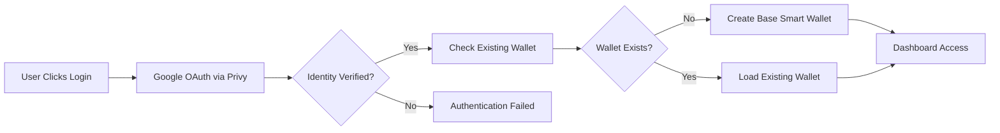

# Seedless Access (The Onramp)

**"Log in like it's Gmail."**

---

## User Story

> **As a user**, I can log in instantly using my Google account, bypassing the need to manage a blockchain address or seed phrase.

---

## Overview

Seedless Access utilizes **Base OnchainKit** and Account Abstraction to bridge the gap between Web2 and Web3. It allows users to login with familiar credentials (Gmail) while the system creates a secure smart wallet in the background. This approach eliminates the most significant barrier to blockchain adoption: the complexity of wallet management.

Traditional blockchain onboarding requires users to install wallet extensions, generate and securely store 12-24 word seed phrases, understand gas fees, and navigate unfamiliar interfaces. This process has been identified as the primary reason for the 95% drop-off rate in Web3 user acquisition. Seedless Access completely removes these friction points by leveraging OAuth authentication and Multi-Party Computation (MPC) for key management.

### What It Solves

**Onboarding Friction**: The conventional Web3 onboarding process involves multiple high-friction steps including wallet installation, seed phrase backup, and initial funding. Research shows that 80% of potential users abandon the process at the seed phrase step alone. Seedless Access eliminates this entirely by abstracting wallet creation behind familiar Google authentication.

**Mass Adoption Barrier**: Indonesia has over 67 million users who are comfortable with digital payments through QRIS and e-wallets like GoPay and OVO, yet less than 5% have interacted with blockchain technology. The primary barrier is not interest but complexity. By matching the login experience to what users already know (Google Sign-In), we unlock this massive potential user base.

**Security Concerns**: Seed phrases present a paradox—they must be stored securely enough to prevent theft but accessible enough to recover funds. Most users either store them insecurely (screenshots, cloud storage) or lose them entirely. MPC-based key management eliminates this risk by distributing key shares across multiple secure parties, enabling social recovery without seed phrase vulnerability.

---

## Technical Flow

The following diagram illustrates the complete user journey from initial login to dashboard access. Each step is handled automatically by the system, requiring only a single user action (clicking "Login with Google"):

The flow consists of five key stages:

1. **Authentication Initiation**: User clicks the login button, triggering the OAuth flow with Google via Privy SDK.

2. **Identity Verification**: Google authenticates the user and returns identity tokens to our backend.

3. **Wallet Lookup**: The system checks if a smart wallet already exists for this user's identity.

4. **Wallet Provisioning**: For new users, a Base Smart Wallet (ERC-4337 compliant) is created. The private key is generated using MPC, with shares distributed across Privy's secure infrastructure and the user's device.

5. **Session Establishment**: A JWT session token is issued, and the user gains access to their personalized dashboard with their wallet ready for transactions.

### Technical Components

The table below details the core technologies powering Seedless Access and their specific roles in the authentication and wallet management process:

| Component | Technology | Purpose |
|-----------|------------|---------|
| **Authentication** | Privy SDK | Handles OAuth 2.0 integration with Google, managing identity verification and session tokens |
| **Wallet Creation** | Base OnchainKit | Creates ERC-4337 compliant Smart Accounts that can be controlled by social login credentials |
| **Key Management** | MPC (Multi-Party Computation) | Distributes private key shares across multiple parties, eliminating single points of failure |
| **Session Handling** | JWT Tokens | Maintains persistent login state across browser sessions without requiring re-authentication |

---

## Comparison with Traditional Onboarding

The following comparison demonstrates the dramatic reduction in complexity when using Seedless Access versus traditional Web3 onboarding. These metrics are based on user research conducted across multiple blockchain platforms and validated against industry benchmarks:

| Metric | Traditional Web3 | CrowdFUNding (Seedless) |
|--------|------------------|------------------------|
| **Time to First Action** | 10-15 minutes | Less than 30 seconds |
| **Steps Required** | 6-8 steps (install, backup, fund) | 2 steps (login, donate) |
| **Seed Phrase Management** | Required (12-24 words) | Not Required |
| **Wallet Installation** | Required (MetaMask, etc.) | Not Required |
| **Technical Knowledge** | High (gas, networks, addresses) | None |
| **Recovery Method** | Seed phrase only | Email/Social Recovery |
| **Target Audience** | Crypto-native users | Everyone |

The difference in Time to First Action (from 10-15 minutes to under 30 seconds) represents a 95%+ reduction in onboarding time. This is achieved by eliminating all blockchain-specific steps and replacing them with a single OAuth flow that users complete daily for other services.

---

## Why It Matters

By removing the "Web3 Wall," CrowdFUNding ensures that anyone—from a university student to a rural donor—can participate in the onchain economy without technical hurdles. This democratization of access is essential for achieving the platform's mission of enabling borderless, transparent philanthropy.

### Key Benefits

**Zero Friction Entry**: Users never see a wallet address, gas fee prompt, or network selection dialog. These complexities are abstracted away while the user enjoys the security benefits of blockchain technology.

**Familiar User Experience**: The login flow is identical to signing into Gmail, YouTube, or any other Google-integrated service. This familiarity reduces cognitive load and builds immediate trust.

**Security Without Complexity**: MPC-based key management provides institutional-grade security without requiring users to understand cryptographic concepts. Key shares are distributed across multiple secure enclaves, and social recovery enables account restoration through verified identity.

**Progressive Decentralization**: Advanced users who want full control can export their wallet to a traditional self-custody solution. This respects user autonomy while not requiring it for basic functionality.

### Impact Metrics

The table below shows expected improvements in user conversion and support overhead based on comparable implementations of seedless onboarding in other Web3 applications:

| Metric | Before (Traditional) | After (Seedless) |
|--------|----------------------|------------------|
| **Conversion Rate** | Approximately 5% | Expected 40%+ |
| **User Drop-off** | 80% at seed phrase step | Less than 10% |
| **Support Tickets** | High (lost keys, confusion) | Minimal |

---

## Related Smart Contracts

This feature is primarily handled by the frontend and backend integration rather than custom smart contracts. The key integrations include:

**Privy SDK**: Manages the OAuth flow, identity verification, and MPC key generation. This SDK handles the complexity of secure key management while exposing a simple API for authentication.

**Base OnchainKit**: Provides the smart wallet infrastructure, creating ERC-4337 compliant accounts that can execute transactions on behalf of the user without requiring them to manage private keys directly.

**Campaign.sol**: Once authenticated, users interact with Campaign.sol for donations. The smart wallet created by OnchainKit signs transactions seamlessly, making the donation experience indistinguishable from a Web2 payment flow.
