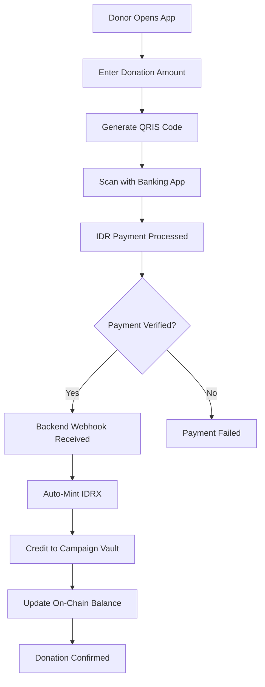

# Instant Fiat Gateway (Local Rail)

**"Scan QRIS, Settle On-Chain."**

---

## User Story

> **As a local donor**, I can scan a QRIS code with my favorite banking app to send funds that settle instantly as IDRX on the Base network.

---

## Overview

The Instant Fiat Gateway allows local donors to use their favorite daily banking apps (GoPay, OVO, BCA, Dana, ShopeePay, and 50+ other QRIS-compatible applications) to contribute to campaigns. The innovation lies in what happens behind the scenes: the fiat payment is instantly converted and settled as **IDRX** on the Base network.

This feature is built on the insight that changing user behavior is expensive and often impossible. Over 100 million Indonesians scan QRIS codes daily for everything from street food to online shopping. Rather than asking these users to learn cryptocurrency, we bring cryptocurrency to them by connecting their existing payment habits to blockchain settlement.

The technical architecture combines traditional payment gateway webhooks with IDRX minting infrastructure. When a donor scans a QRIS code and completes payment through their banking app, our backend receives instant confirmation, triggers IDRX minting, and credits the campaign's on-chain vault—all within seconds of the original payment.

### What It Solves

**Financial Leakage**: Traditional cross-border and high-friction payment gateways extract an average of 12.66% from each transaction through a combination of platform fees, payment processing fees, currency conversion spreads, and withdrawal fees. For a donation of Rp 100,000, only Rp 87,340 would typically reach the recipient. The IDRX-based settlement eliminates these intermediary costs, as the blockchain transaction fee (gas) is negligible.

**Settlement Delays**: Conventional donation platforms operate on bank clearing schedules, meaning funds may take 3-5 business days to become available to campaign creators. In emergency situations—natural disasters, medical emergencies—this delay can be the difference between effective intervention and arriving too late. IDRX settlement is instant; funds are available in the campaign vault within seconds of payment confirmation.

**Behavioral Friction**: Asking users to adopt new payment methods dramatically reduces conversion rates. Studies show that each additional step in a checkout process reduces completion by 10-15%. By accepting QRIS—which users already know and trust—we eliminate adoption friction entirely.

---

## Technical Flow

The following diagram traces a donation from the moment a user opens the app to the final on-chain settlement. This entire process completes in under 30 seconds for most banking applications:



Each step in the process serves a specific purpose:

1. **Amount Entry**: The donor specifies how much they wish to contribute in Indonesian Rupiah. The interface shows the equivalent amount in IDRX (which is 1:1 pegged to IDR).

2. **QRIS Generation**: A unique QR code is generated containing payment details. This is a standard QRIS format recognized by all Indonesian banking apps.

3. **Payment Execution**: The donor scans the code using their preferred banking app and confirms payment using their existing security methods (PIN, biometrics).

4. **Webhook Processing**: Upon payment completion, the payment gateway sends an instant webhook to our backend with transaction confirmation.

5. **IDRX Minting**: The backend calls the IDRX minting API, creating new IDRX tokens equivalent to the IDR amount received.

6. **On-Chain Settlement**: The newly minted IDRX is transferred to the campaign's vault on Base, and the Campaign.sol contract's balance is updated.

### Technical Components

The following table describes each component in the Instant Fiat Gateway pipeline and explains how they work together to achieve seamless fiat-to-crypto settlement:

| Component | Technology | Purpose |
|-----------|------------|---------|
| **QRIS Generation** | Payment Gateway API | Generates dynamic QR codes containing unique transaction identifiers and amount information |
| **Payment Verification** | Webhook Listener | Receives real-time payment confirmations from banking infrastructure with cryptographic signatures |
| **IDR to IDRX Bridge** | IDRX Minting API | Converts verified fiat payments into on-chain IDRX tokens at 1:1 parity |
| **On-Chain Settlement** | Campaign.sol | Records the donation in the campaign's balance and emits trackable events |
| **Event Emission** | DonationReceived Event | Provides transparent, queryable record of all donations for auditing and display |

### Smart Contract Integration

When IDRX arrives at the Campaign contract, the following function handles the deposit. Note that because IDRX is the storage token, no swap is required—the tokens are credited directly to the campaign balance:

```solidity
// Campaign.sol - donate function for IDRX
function donate(uint256 campaignId, uint256 amount, address tokenIn) public nonReentrant {
    // If tokenIn is IDRX (storageToken), direct transfer
    if (tokenIn == storageToken) {
        IERC20(tokenIn).safeTransferFrom(msg.sender, address(this), amount);
        _campaigns[campaignId].balance += amount;
        emit DonationReceived(campaignId, msg.sender, amount);
    }
    // For other tokens, auto-swap logic would execute here
}
```

---

## Comparison with Traditional Payment Methods

The table below compares the Instant Fiat Gateway against conventional donation payment methods. These comparisons are based on published fee schedules and processing times from major Indonesian payment providers:

| Metric | Bank Transfer | E-Wallet (Traditional) | CrowdFUNding (QRIS + IDRX) |
|--------|---------------|------------------------|---------------------------|
| **Processing Fee** | 0.5% - 2.5% | 1% - 3% | 0% |
| **Settlement Time** | 3-5 business days | 1-3 business days | Instant |
| **Transparency** | Bank statement only | App history only | Full on-chain audit |
| **Cross-Platform** | Limited | Platform-specific | Universal (any QRIS app) |
| **Micro-donations** | Impractical (fees exceed value) | Moderate | Fully supported |
| **Audit Trail** | Manual reconciliation | Manual export | Automatic, immutable |

The most significant advantages are in transparency and settlement time. While traditional platforms require donors to trust that their funds are being handled correctly, CrowdFUNding provides cryptographic proof of every transaction that anyone can verify on the Base blockchain.

---

## Competitive Advantage vs Other Platforms

This comparison focuses on the most popular Indonesian crowdfunding platforms. The data reflects their published fee structures and operational processes as of January 2026:

| Feature | Kitabisa | BenihBaik | CrowdFUNding |
|---------|----------|-----------|--------------|
| **Platform Fee** | 5% | 5-10% | 2.5% |
| **Payment Gateway Fee** | 0.7-2% + VA | 1.5-3% | Rp 0 (via IDRX QRIS) |
| **Settlement Speed** | 3-5 days | Batch processed | Instant |
| **Transaction Proof** | PDF receipt | Email confirmation | On-chain immutable record |
| **Real-time Tracking** | Delayed updates | Delayed updates | Live blockchain updates |

The combined platform and payment gateway fees on traditional platforms typically range from 5.7% to 13%. CrowdFUNding's 2.5% platform fee with zero payment gateway costs represents a 50-80% reduction in total fees. For a campaign raising Rp 100 million, this difference translates to Rp 3-10 million more reaching the intended recipients.

---

## Why It Matters

This feature meets the user where they are. It does not ask donors to change their behavior (scanning QRIS is already daily life in Indonesia), but instead upgrades the underlying infrastructure to be faster, cheaper, and transparent.

### Key Benefits

**Zero Behavior Change**: Donors use the same banking apps they use for groceries, transportation, and online shopping. There is no new app to install, no account to create, and no learning curve.

**Instant Settlement**: Campaign creators can access funds within seconds of donation, not days. This is critical for time-sensitive causes like medical emergencies or disaster relief.

**Full Transparency**: Every transaction is recorded on the Base blockchain. Donors can verify that their funds reached the campaign, and auditors can examine the complete transaction history without requesting access from the platform.

**Fee Elimination**: By using IDRX for settlement, we bypass the traditional payment gateway fee structure entirely. The only cost is the minimal gas fee on Base (typically less than $0.01).

**Stable Value**: IDRX is pegged 1:1 to Indonesian Rupiah, providing price stability without the volatility concerns typically associated with cryptocurrency. Donors know exactly how much of their contribution will reach the campaign.

### Impact Metrics

The following metrics demonstrate the improvement in donation efficiency when using the Instant Fiat Gateway compared to traditional crowdfunding platforms:

| Metric | Traditional Platforms | CrowdFUNding |
|--------|----------------------|--------------|
| **Total Fee Saved** | 12.66% lost to fees | Less than 3% total cost |
| **Settlement Time** | 3-5 business days | Less than 30 seconds |
| **Audit Time** | Hours to days (manual) | Real-time (automatic) |

---

## Related Smart Contracts

The Instant Fiat Gateway integrates with the following smart contracts deployed on Base Sepolia:

**Campaign.sol**: The core contract that receives IDRX donations through the `donate(campaignId, amount, tokenIn)` function. When tokenIn matches the storage token (IDRX), the donation is credited directly without requiring a swap operation.

**MockIDRX.sol**: An ERC20 token contract representing Indonesian Rupiah on-chain. In production, this would be replaced with the official IDRX token. The token uses 2 decimal places to match the real-world IDR denomination (no cents in Rupiah).
