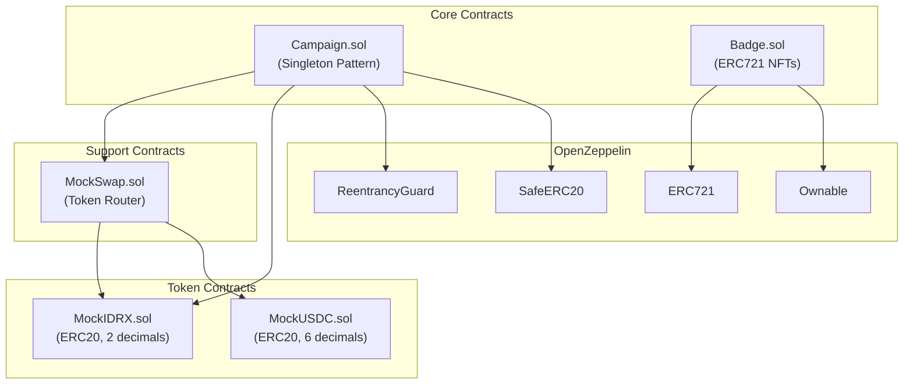
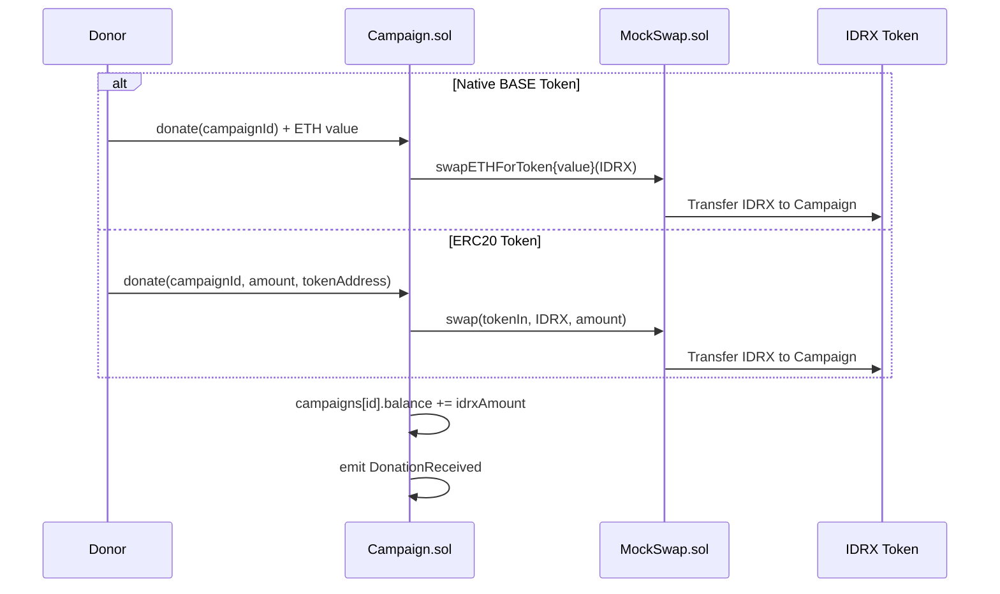
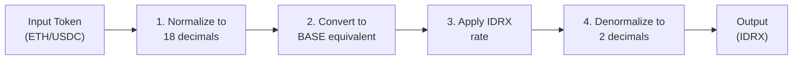
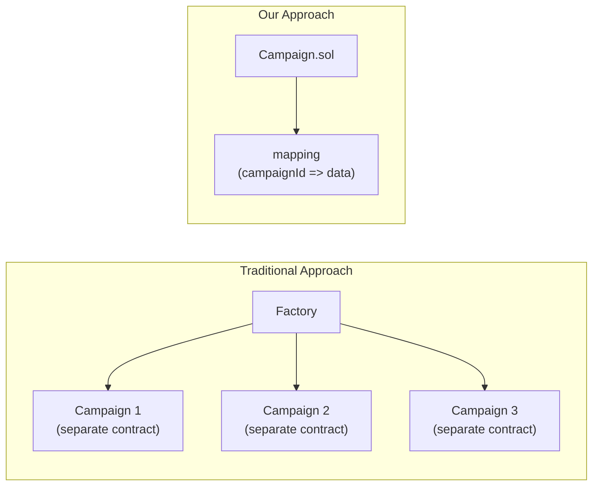
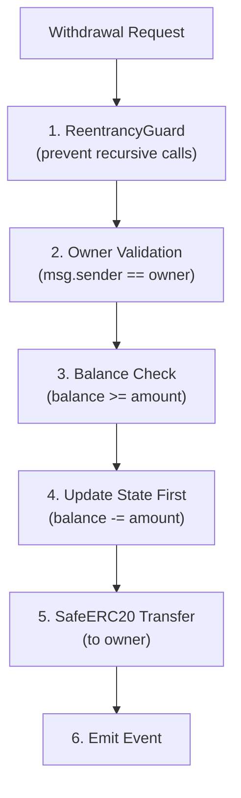

# 1. Smart Contract Architecture

This document details the architectural design and code structure of the CrowdFUNding smart contracts. The system is built on Base Sepolia using Solidity 0.8.30 and the Foundry development framework.

## Contract Overview

The CrowdFUNding smart contracts consist of five main contracts that work together to enable gamified crowdfunding with multi-currency support. The following diagram shows how these contracts interact:



## Core Contracts

### 1. Campaign.sol - The Heart of CrowdFUNding

This contract is the central hub of the CrowdFUNding platform. It manages all crowdfunding campaigns using a **gas-efficient singleton pattern**, meaning one contract instance manages all campaigns rather than deploying a new contract for each campaign.

#### State Variables

The following table describes the main state variables:

| Variable | Type | Description |
|----------|------|-------------|
| `_campaigns` | `mapping(uint256 => CampaignStruct)` | Stores all campaign data by ID |
| `_campaignIds` | `uint256` | Counter for generating unique campaign IDs |
| `mockSwap` | `MockSwap` | Reference to the token swap router |
| `storageToken` | `address` | Address of IDRX (the unified storage token) |

#### CampaignStruct

Each campaign stores the following data on-chain:

```solidity
struct CampaignStruct {
    string name;           // Campaign title
    string creatorName;    // Creator's display name
    uint256 balance;       // Current balance (in IDRX)
    uint256 targetAmount;  // Funding goal (in IDRX)
    uint256 creationTime;  // Block timestamp of creation
    address owner;         // Campaign creator's wallet
}
```

#### Core Functions

The Campaign contract exposes the following public functions:

| Function | Access | Description |
|----------|--------|-------------|
| `createCampaign(name, creatorName, targetAmount)` | Public | Creates a new campaign and assigns a unique ID |
| `donate(campaignId)` | Public Payable | Donate with BASE native token (auto-swaps to IDRX) |
| `donate(campaignId, amount, tokenIn)` | Public | Donate with any supported ERC20 token |
| `withdraw(campaignId, amount)` | Owner Only | Withdraw IDRX from campaign balance |
| `getCampaignInfo(campaignId)` | View | Returns complete campaign details |

#### Events

The contract emits these events for indexing and frontend updates:

```solidity
event CampaignCreated(
    uint256 id, 
    string name, 
    string creatorName, 
    address owner, 
    uint256 targetAmount, 
    uint256 creationTime
);

event DonationReceived(
    uint256 id, 
    address donor, 
    uint256 amount
);

event FundWithdrawn(
    uint256 id, 
    string name, 
    address owner, 
    string creatorName, 
    uint256 amount
);
```

#### Donation Flow with Auto-Swap

The donation process automatically converts any currency to IDRX for consistent campaign accounting:



### 2. Badge.sol - Gamification NFTs

This contract implements achievement badges as ERC721 NFTs, adding the "FUN" to CrowdFUNding. Each badge represents an achievement unlocked by users.

#### Key Components

| Component | Type | Description |
|-----------|------|-------------|
| Standard | ERC721 | Non-Fungible Token standard for unique badges |
| Inheritance | ERC721, Ownable | Token with owner-only minting |
| `_tokenIds` | Counter | Auto-incrementing token IDs |
| `_badgeInfo` | mapping | Stores badge metadata |

#### BadgeInfo Structure

Each badge stores descriptive metadata:

```solidity
struct BadgeInfo {
    string name;         // Badge title (e.g., "First Donor")
    string description;  // Achievement description
}
```

#### Functions

| Function | Access | Description |
|----------|--------|-------------|
| `mintBadge(to, name, description)` | Owner Only | Mint a new badge NFT to a user |
| `getBadgeInfo(tokenId)` | View | Returns badge name and description |

### 3. MockSwap.sol - Token Exchange Router

This contract handles automatic token conversions for multi-currency donations. It maintains exchange rates and performs swaps between supported tokens.

#### Swap Logic Flow

The following diagram shows how the swap calculation works:



#### Functions

| Function | Description |
|----------|-------------|
| `addToken(name, tokenAddress, decimals, ratePerETH)` | Register a new token with its exchange rate |
| `swap(tokenIn, tokenOut, amountIn)` | Swap between two ERC20 tokens |
| `swapETHForToken(tokenOut)` | Swap native ETH for an ERC20 token |
| `getQuote(tokenIn, tokenOut, amountIn)` | Get expected output amount without executing |

#### Exchange Rates (Testnet)

The following exchange rates are configured for the testnet:

| Token | Rate per 1 BASE (ETH) | Decimals |
|-------|----------------------|----------|
| IDRX  | 268,400 IDRX         | 2        |
| USDC  | 0.16 USDC            | 6        |

### 4. Mock Token Contracts

These ERC20 token contracts simulate IDRX and USDC for testing purposes.

#### MockIDRX.sol

```solidity
Name:     "IDRX"
Symbol:   "IDRX"
Decimals: 2  // Mirrors actual Indonesian Rupiah (no cents)
```

#### MockUSDC.sol

```solidity
Name:     "USDC"
Symbol:   "USDC"
Decimals: 6  // Standard USDC decimals
```

Both tokens include a public `mint(address, amount)` function for testing purposes.

## Design Patterns

### 1. Singleton Pattern

Instead of deploying a new contract for each campaign, one Campaign.sol instance manages all campaigns:



**Benefits:**
- Saves gas on deployment
- Centralized event indexing
- Easier upgrades and maintenance
- Simpler contract verification

### 2. Unified Storage Token Pattern

All donations are automatically converted to IDRX regardless of the input currency:

**Benefits:**
- Simplifies accounting for campaign creators
- Predictable withdrawal amounts
- No forex complexity
- Easy integration with fiat off-ramps

### 3. Factory Pattern (for Badges)

The Badge contract acts as a factory that mints unique NFTs:

**Benefits:**
- Single contract manages all badges
- Consistent metadata structure
- Centralized access control

## Deployed Contracts (Base Sepolia)

The following contracts are deployed and verified on Base Sepolia:

| Contract | Address | Explorer |
|----------|---------|----------|
| **Mock IDRX** | `0x387551ac55Bb6949d44715D07880f8c6260934B6` | [View](https://sepolia.basescan.org/address/0x387551ac55Bb6949d44715D07880f8c6260934B6) |
| **Mock USDC** | `0x1b929eB40670aA4e0D757d45cA9aea2311a25a97` | [View](https://sepolia.basescan.org/address/0x1b929eB40670aA4e0D757d45cA9aea2311a25a97) |
| **MockSwap** | `0x554366984fD2f5D82c753F91357d80c29F887F17` | [View](https://sepolia.basescan.org/address/0x554366984fD2f5D82c753F91357d80c29F887F17) |
| **Campaign** | `0x44e87aa98d721Dbcf368690bF5aAb1F3dD944dA9` | [View](https://sepolia.basescan.org/address/0x44e87aa98d721Dbcf368690bF5aAb1F3dD944dA9) |
| **Badge** | `0xaE32Df9Fb677aE68C5A1F956761a42e269Ebdc99` | [View](https://sepolia.basescan.org/address/0xaE32Df9Fb677aE68C5A1F956761a42e269Ebdc99) |

## Security Considerations

The contracts implement multiple security measures to protect user funds:

| Threat | Mitigation | Implementation |
|--------|------------|----------------|
| **Reentrancy** | ReentrancyGuard modifier | Applied to `donate()` and `withdraw()` |
| **Token Transfer Failures** | SafeERC20 library | All `transfer()` calls use `safeTransfer()` |
| **Unauthorized Withdrawal** | Owner validation | `require(msg.sender == campaign.owner)` |
| **Integer Overflow** | Solidity 0.8+ | Built-in overflow checks |
| **Front-running** | Minimal MEV exposure | Accept-based logic, no price-sensitive operations |

### Security Flow

The following diagram shows the security checks during a withdrawal:


