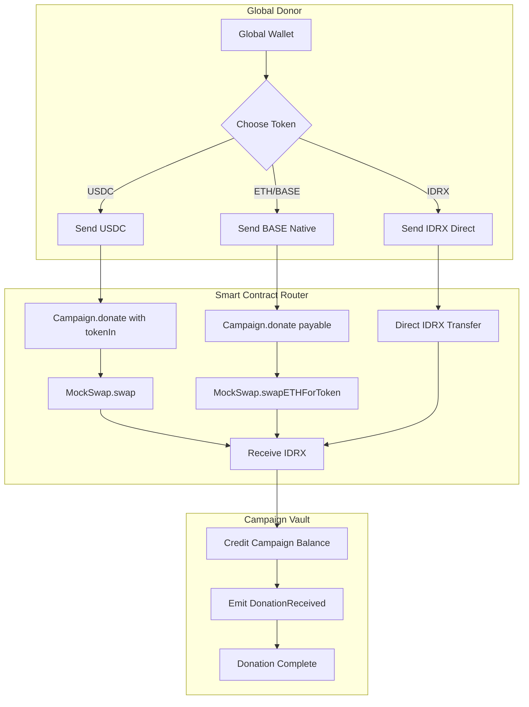

# Borderless Liquidity Rail (Global Rail)

> **As a global supporter**, I can donate USDC or other stablecoins on Base and have it automatically converted to IDRX to protect the recipient from volatility.

---

## Overview

The Borderless Liquidity Rail enables international supporters to donate using **USDC**, **ETH/BASE**, or other tokens on Base. The protocol automatically swaps these assets into **IDRX** in a single atomic transaction, ensuring campaign creators receive stable, local-currency-denominated funds.

This feature addresses the fundamental currency mismatch in global philanthropy: international donors hold USD while local recipients need Indonesian Rupiah. Traditional solutions involve multiple intermediaries extracting fees and adding delays. The Borderless Liquidity Rail collapses this into a single on-chain transaction.

### What It Solves

1. **Volatility Risk**: Many NGOs hesitate to accept crypto donations because a 100 USDC donation today might be worth $85 when withdrawn next week. By converting all donations to IDRX (pegged 1:1 to IDR) at the moment of receipt, we eliminate this risk. Campaign creators always know exactly how much value they have.

2. **Global Access Barriers**: The World Bank reports cross-border remittance fees average 6.2% globally, with some corridors exceeding 15%. For charitable donations, these fees represent resources diverted from their purpose. The Borderless Liquidity Rail enables a donor in New York to support a campaign in Jakarta with transaction costs under 1%.

3. **Currency Fragmentation**: Without automated conversion, campaign managers must track balances in USDC, ETH, IDRX, and potentially others. This complexity makes accounting difficult and exposes campaigns to errors. By converting everything to IDRX at donation time, we provide unified accounting in a single currency.

---

## Technical Flow

The following diagram illustrates how donations in different tokens are processed through the Borderless Liquidity Rail. Note that regardless of input token, all donations end up as IDRX in the campaign vault:



The flow handles three distinct input scenarios:

**USDC Donations**: When a donor sends USDC, the Campaign contract receives the tokens via `safeTransferFrom`, approves MockSwap to spend them, and calls `swap()` to convert USDC to IDRX. The resulting IDRX is credited to the campaign.

**Native Token (BASE/ETH) Donations**: For native currency donations, the Campaign contract calls `swapETHForToken()` on MockSwap, sending the ETH value along with the call. MockSwap converts the ETH to IDRX based on the configured exchange rate.

**Direct IDRX Donations**: If a donor already has IDRX (perhaps from a previous conversion), they can donate directly without incurring any swap. The tokens transfer straight to the campaign balance.

### Smart Contract Integration

The following code shows how Campaign.sol handles native token donations with automatic conversion to IDRX. The balance difference calculation ensures accurate accounting regardless of exchange rate fluctuations:

```solidity
// Campaign.sol - Native token (BASE/ETH) donation with auto-swap
function donate(uint256 campaignId) public payable nonReentrant {
    // Get balance before swap
    uint256 balanceBefore = IERC20(storageToken).balanceOf(address(this));

    // Swap ETH to storageToken (IDRX)
    mockSwap.swapETHForToken{value: msg.value}(storageToken);

    // Calculate how much storageToken we received
    uint256 balanceAfter = IERC20(storageToken).balanceOf(address(this));
    uint256 amountToStore = balanceAfter - balanceBefore;

    _campaigns[campaignId].balance += amountToStore;
    emit DonationReceived(campaignId, msg.sender, amountToStore);
}
```

For ERC20 donations (like USDC), the logic detects whether a swap is needed and routes accordingly:

```solidity
// Campaign.sol - ERC20 donation with auto-swap
function donate(uint256 campaignId, uint256 amount, address tokenIn) public nonReentrant {
    if (tokenIn == storageToken) {
        // Direct IDRX transfer - no swap needed
        IERC20(tokenIn).safeTransferFrom(msg.sender, address(this), amount);
        amountToStore = amount;
    } else {
        // Auto-swap to IDRX via MockSwap
        IERC20(tokenIn).safeTransferFrom(msg.sender, address(this), amount);
        IERC20(tokenIn).approve(address(mockSwap), amount);
        mockSwap.swap(tokenIn, storageToken, amount);
        // Calculate amountToStore from balance difference
    }
    _campaigns[campaignId].balance += amountToStore;
}
```

### Technical Components

The following table describes the components that make up the Borderless Liquidity Rail and their roles in enabling seamless multi-currency donations:

| Component            | Technology         | Purpose                                                                             |
| -------------------- | ------------------ | ----------------------------------------------------------------------------------- |
| **Token Router**     | Campaign.sol       | Detects input token type and routes to appropriate swap function or direct transfer |
| **Swap Engine**      | MockSwap.sol       | Executes token-to-IDRX conversions using configured exchange rates                  |
| **Rate Oracle**      | On-chain rates     | Provides verifiable exchange rates for all supported token pairs                    |
| **Atomic Execution** | Single Transaction | Ensures swap and donation either both succeed or both fail—no partial states        |

---

## Exchange Rate Mechanism

The MockSwap contract uses a normalized 18-decimal system to ensure accurate conversions across tokens with different decimal configurations. The following diagram explains the calculation flow:

```
+------------------------------------------------------------------+
|                    Swap Calculation Flow                         |
+------------------------------------------------------------------+
|  1. Normalize input to 18 decimals                               |
|     normalizedIn = amountIn * 10^(18 - inputDecimals)            |
|                                                                  |
|  2. Convert to ETH equivalent                                    |
|     ethEquivalent = (normalizedIn * 10^18) / ethToTokenRate      |
|                                                                  |
|  3. Convert ETH to output token                                  |
|     normalizedOut = (ethEquivalent * outputEthToToken) / 10^18   |
|                                                                  |
|  4. Denormalize to output decimals                               |
|     amountOut = normalizedOut / 10^(18 - outputDecimals)         |
+------------------------------------------------------------------+
```

This normalization approach allows the swap engine to handle tokens with vastly different decimal places (USDC has 6, IDRX has 2, most tokens have 18) without precision loss.

### Current Exchange Rates (Testnet)

The following table shows the exchange rates configured on the testnet deployment. In production, these rates would be sourced from on-chain oracles like Chainlink or calculated from DEX liquidity pools:

| Token | Rate per 1 BASE | Decimals | Notes                                      |
| ----- | --------------- | -------- | ------------------------------------------ |
| USDC  | 0.16 USDC       | 6        | Represents approximately $0.16 per BASE    |
| IDRX  | 2,684 IDRX      | 2        | Represents approximately Rp 2,684 per BASE |

**Example Calculation**: A donation of 100 USDC would convert as follows:

- 100 USDC at $1 = $100 equivalent
- $100 at Rp 16.775 = approximately 1,677,500 IDRX
- Campaign receives exactly 1,677,500 IDRX (Rp 16,775,000)

---

## Comparison with Traditional Cross-Border Donations

The following table compares the Borderless Liquidity Rail against traditional international donation methods. The fee and timing data is sourced from World Bank remittance databases and payment processor published rates:

| Metric                  | Bank Wire (SWIFT)      | PayPal International | CrowdFUNding (Base)        |
| ----------------------- | ---------------------- | -------------------- | -------------------------- |
| **Transfer Fee**        | $25-50 + 3-5%          | 4-5% + forex markup  | Less than 0.01% (gas only) |
| **Settlement Time**     | 3-7 business days      | 1-3 business days    | Instant                    |
| **Minimum Amount**      | $100+ practical        | $10+ practical       | No minimum                 |
| **Currency Conversion** | Bank's forex rate      | PayPal's markup      | Transparent on-chain rate  |
| **Tracking**            | SWIFT reference only   | Transaction ID       | Full blockchain explorer   |
| **Recipient Gets**      | Unknown until received | Estimated            | Exact IDRX amount shown    |

The reduction in transfer fees from 4-8% (traditional) to under 0.01% (blockchain) is the most significant improvement. For large campaigns raising millions of rupiah, this represents substantial additional funds reaching beneficiaries.

---

## Competitive Advantage

The following comparison positions the Borderless Liquidity Rail against both traditional charity platforms and existing crypto donation sites:

| Feature                    | Traditional Charity           | Crypto Donation Sites           | CrowdFUNding                 |
| -------------------------- | ----------------------------- | ------------------------------- | ---------------------------- |
| **Multi-currency Support** | Limited (USD, local currency) | Token-specific per campaign     | Any token converts to IDRX   |
| **Volatility Protection**  | Not applicable (fiat)         | Recipient bears all risk        | Auto-convert to stable IDRX  |
| **Unified Accounting**     | Multi-currency complexity     | Multi-token tracking needed     | Single IDRX ledger           |
| **Atomic Swap**            | Not applicable                | Manual DEX interaction required | Built-in, single transaction |
| **Global to Local Bridge** | High friction (SWIFT, forex)  | Remains in crypto               | Seamless USDC to IDRX        |

The key differentiator is the combination of multi-currency acceptance with stable-currency settlement. Donors can contribute using their preferred asset while campaign creators receive predictable, local-currency-denominated value.

---

## Why It Matters

The Borderless Liquidity Rail creates a true "Global-Local" bridge. A donor in New York can support a flood relief victim in Jakarta instantly, with the recipient getting spendable local currency value immediately.

### Key Benefits

1. **Zero Volatility Risk**: Campaign creators never need to worry about cryptocurrency price fluctuations. All donations are converted to IDRX at receipt, locking in the Rupiah value immediately.

2. **Global Participation**: Anyone with USDC, ETH, or BASE can donate to Indonesian causes without needing to acquire IDRX first. This dramatically expands the potential donor pool.

3. **Unified Accounting**: Finance teams don't need to track multiple currencies or token types. All campaign balances are denominated in IDRX, simplifying reporting and planning.

4. **Atomic Transactions**: The swap and donation happen in a single blockchain transaction. There's no risk of a swap succeeding but donation failing, or vice versa.

5. **Transparent Rates**: Exchange rates are stored on-chain and can be verified by anyone. Unlike traditional forex where banks set opaque spreads, all rate calculations are visible and auditable.

### Impact Metrics

The following metrics quantify the improvement in cross-border donation efficiency enabled by the Borderless Liquidity Rail:

| Metric                      | Before (Traditional)              | After (CrowdFUNding) |
| --------------------------- | --------------------------------- | -------------------- |
| **Cross-border Fee**        | 12.66% average                    | Less than 1%         |
| **Settlement Time**         | 7-14 days                         | Less than 30 seconds |
| **Minimum Viable Donation** | $50+ (lower amounts uneconomical) | Any amount           |
| **Currency Risk**           | Borne by recipient                | Eliminated           |

---

## Related Smart Contracts

The Borderless Liquidity Rail is implemented through the following deployed contracts:

**Campaign.sol** (0x44e87aa98d721Dbcf368690bF5aAb1F3dD944dA9): The core donation logic including auto-swap integration. Handles routing between direct IDRX transfers and swap-required donations.

**MockSwap.sol** (0x554366984fD2f5D82c753F91357d80c29F887F17): The token exchange engine providing `swap()` for ERC20-to-ERC20 conversions and `swapETHForToken()` for native currency conversions.

**MockIDRX.sol** (0x387551ac55Bb6949d44715D07880f8c6260934B6): The storage token representing Indonesian Rupiah on-chain. All campaign balances are denominated in this token.

**MockUSDC.sol** (0x1b929eB40670aA4e0D757d45cA9aea2311a25a97): A test implementation of USDC for demonstrating global stablecoin donations on testnet.
