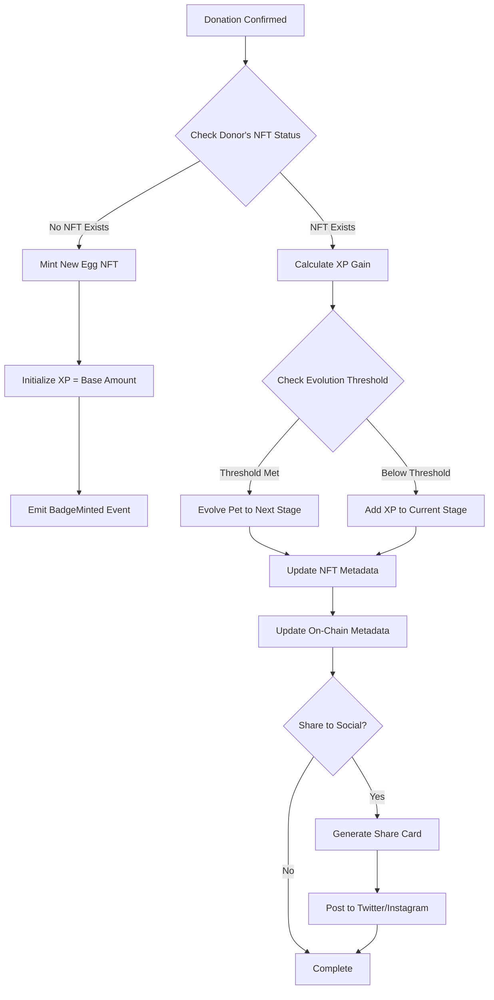
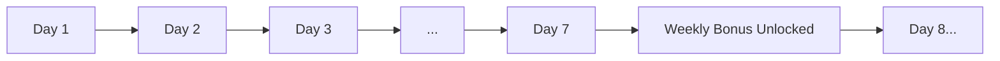

# Dynamic Proof of Impact (Gamification)

> **As a contributor**, I receive a digital pet on Base that evolves to provide a verifiable on-chain record of my impact, with an optional button to share my progress to social media.

---

## Overview

This feature replaces static "Thank You" emails with a living **Digital Pet (NFT)** that evolves based on donation behavior. The pet grows from an egg to a mature companion as the donor maintains their "Impact Streak," transforming one-time donors into recurring contributors.

Traditional philanthropy treats donations as terminal transactions—81% of first-time donors never return. By introducing game mechanics (progression, collection, social status), we transform giving from a single transaction into an ongoing relationship using psychological principles proven in mobile gaming.

### What It Solves

1. **Donor Fatigue**: Industry data shows only 19% of first-time donors return, forcing platforms to constantly acquire new donors—an expensive and unsustainable model. The gamification layer introduces variable rewards, progression mechanics, and loss aversion that have been proven to drive 65%+ retention in gaming contexts.

2. **Economic Stagnation**: Indonesians spend $445 million annually on virtual goods in mobile games—cosmetic items with no real-world value. CrowdFUNding redirects this spending pattern toward social impact by offering the same psychological rewards (status, collection, progression) attached to philanthropic actions.

3. **Engagement Cliff**: Traditional platforms have no reason for donors to return between fundraising appeals. Even satisfied donors simply forget about the platform until the next email campaign. The pet mechanic creates daily/weekly check-in incentives—"How is my pet doing? Can I evolve it this week?"—maintaining continuous engagement.

---

## Technical Flow

The following diagram shows how a donation triggers the gamification system. The flow branches based on whether the donor already has an NFT pet, either creating a new one or updating the existing pet's state:



The process handles three main scenarios:

**New Donor (First Donation)**: The system mints a fresh NFT in the "Egg" state. Initial XP is set based on the donation amount, and the BadgeMinted event is emitted for indexing.

**Returning Donor (XP Addition)**: XP is calculated from the donation amount plus any streak bonuses. If the total XP crosses an evolution threshold, the pet advances to the next stage with updated visual representation.

**Social Sharing**: After any pet update, the donor can optionally generate a shareable card showing their pet and impact statistics. This drives organic user acquisition through social proof.

### Evolution Stages

The following progression system defines how pets evolve based on cumulative XP. The XP thresholds are calibrated to encourage sustained giving behavior while making early progress feel achievable:

```
+------------------------------------------------------------------+
|                    Pet Evolution Journey                         |
+------------------------------------------------------------------+
|                                                                  |
|   [Egg]         ->   [Hatchling]    ->   [Youth]                 |
|   (0 XP)             (100 XP)            (500 XP)                |
|                                                                  |
|   [Adult]       ->   [Elder]        ->   [Legendary]             |
|   (2,000 XP)         (10,000 XP)         (50,000 XP)             |
|                                                                  |
|   XP = Cumulative donation value + Streak bonuses                |
|                                                                  |
+------------------------------------------------------------------+
```

The stages are designed with specific psychological triggers:

- **Egg to Hatchling** (100 XP): Achievable with a single modest donation, providing immediate reward
- **Hatchling to Youth** (500 XP): Requires 2-3 donations, introducing the repeat behavior
- **Youth to Adult** (2,000 XP): Represents committed donor status, approximately 4-5 donations
- **Adult to Elder** (10,000 XP): Long-term supporter milestone
- **Elder to Legendary** (50,000 XP): Rare achievement signaling exceptional commitment

### Smart Contract Integration

The Badge.sol contract implements ERC-721 for the pet NFTs. The following code shows the minting function that creates new pets when donors make their first contribution:

```solidity
// Badge.sol - NFT minting for achievements
contract Badge is ERC721, Ownable {
    struct BadgeInfo {
        uint256 id;
        string name;
        string description;
    }

    mapping(uint256 => BadgeInfo) private _badgeInfos;

    /// @notice Mint a new Badge to `to` with given `name` and `description`
    function mintBadge(
        address to,
        string memory name,
        string memory description
    ) external onlyOwner {
        uint256 tokenId = (_currentTokenId++);
        _safeMint(to, tokenId);
        _badgeInfos[tokenId] = BadgeInfo({
            id: tokenId,
            name: name,
            description: description
        });
        emit BadgeMinted(tokenId, to, name);
    }
}
```

The `onlyOwner` modifier ensures that only the authorized backend service can mint badges, preventing unauthorized NFT creation while allowing the protocol to respond to donation events.

### Technical Components

The table below describes each component in the gamification system and explains its role in creating the pet evolution experience:

| Component            | Technology                   | Purpose                                                                          |
| -------------------- | ---------------------------- | -------------------------------------------------------------------------------- |
| **NFT Contract**     | Badge.sol (ERC721)           | Mints and manages pet NFTs with unique token IDs and metadata                    |
| **Metadata Storage** | IPFS / On-chain              | Stores pet visual assets and current state (XP, evolution stage)                 |
| **XP Calculation**   | Backend Service              | Processes donation events, applies streak bonuses, determines evolution triggers |
| **Evolution Logic**  | Smart Contract               | Updates NFT metadata when XP thresholds are crossed                              |
| **Social Sharing**   | Farcaster Frames / OpenGraph | Generates visually appealing share cards with pet imagery and impact stats       |

---

## Gamification Mechanics

### XP System

The following table details how XP is earned through various actions. The multipliers reward consistent behavior and social contribution:

| Action                        | XP Reward           | Multiplier | Rationale                       |
| ----------------------------- | ------------------- | ---------- | ------------------------------- |
| **First Donation**            | 100 XP bonus        | 1.5x       | Rewards initial commitment      |
| **Per 1,000 IDRX**            | 10 XP               | 1x         | Base earning rate               |
| **Daily Streak (7 days)**     | 50 XP bonus         | 1.2x       | Encourages habit formation      |
| **Weekly Streak (4 weeks)**   | 200 XP bonus        | 1.5x       | Rewards medium-term consistency |
| **Monthly Streak (3 months)** | 1,000 XP bonus      | 2x         | Celebrates long-term commitment |
| **Referral Donation**         | 25% of referee's XP | 1x         | Incentivizes social sharing     |

The XP formula creates compound rewards for consistent givers. A donor who gives small amounts regularly will out-earn a donor who gives one large sum, aligning incentives with the behavioral patterns that maximize lifetime value.

### Streak System

The streak mechanic introduces loss aversion—a powerful psychological driver. Once a donor has built a streak, they become motivated not just to continue but to avoid losing their progress:



The system is designed to be forgiving while still creating meaningful goals. Missing a single day doesn't reset the streak entirely—instead, it pauses progress. This prevents frustration while maintaining engagement.

---

## Comparison with Traditional Donor Recognition

The following table compares the Dynamic Proof of Impact system against traditional donor recognition methods and subscription-based engagement apps:

| Feature              | Traditional Charity       | Subscription Apps     | CrowdFUNding NFT Pets     |
| -------------------- | ------------------------- | --------------------- | ------------------------- |
| **Recognition**      | Static certificate        | Badge/level           | Living, evolving NFT      |
| **Proof of Impact**  | Paper receipt             | Database record       | Immutable on-chain record |
| **Engagement Loop**  | Annual newsletter         | Points system         | Tamagotchi-style care     |
| **Social Sharing**   | Manual screenshot         | Limited functionality | One-tap social cards      |
| **Ownership**        | None (platform owns data) | Platform-locked       | True ownership (NFT)      |
| **Transferability**  | Not applicable            | Not applicable        | Tradeable on marketplaces |
| **Retention Driver** | Guilt/appeals             | Points and rewards    | Emotional connection      |

The critical differentiator is true ownership. Traditional platforms hold donor records that donors cannot export or prove. NFT pets exist on the blockchain independent of CrowdFUNding—even if our platform ceased to exist, donors would retain their pets and the complete history of their philanthropic activity.

---

## Competitive Advantage

The following comparison focuses on donor retention and engagement metrics across major crowdfunding platforms:

| Metric               | GoFundMe                | Kitabisa             | CrowdFUNding           |
| -------------------- | ----------------------- | -------------------- | ---------------------- |
| **Donor Retention**  | Approximately 15%       | Approximately 19%    | Target: 65%            |
| **Engagement Model** | One-time transaction    | Occasional campaigns | Daily streak incentive |
| **Social Virality**  | Limited sharing options | Basic sharing        | Gamified share cards   |
| **Digital Assets**   | None                    | None                 | Evolving NFT pets      |
| **Proof of Giving**  | Email receipt           | PDF certificate      | On-chain badge         |

The 65% retention target is based on comparable gamification implementations in fitness apps (Strava, Nike Run Club) and language learning (Duolingo), which have demonstrated similar streak mechanics can drive retention 3-4x above industry baselines.

---

## Why It Matters

The gamification layer shifts the psychology of giving from "loss" (giving money away) to "gain" (building a digital legacy). It also creates viral loops as users share their evolved pets on social media, driving organic user acquisition at zero marginal cost.

### Key Benefits

1. **Emotional Investment**: The pet is not just a receipt—it's a companion that donors nurture over time. This emotional attachment creates intrinsic motivation to continue giving.

2. **Social Proof**: An evolved, rare pet signals status within the community. Public leaderboards and evolution stage displays create positive social pressure to maintain giving habits.

3. **Viral Mechanics**: Every share card posted to social media is free advertising for the platform. The visual appeal of the evolving pets encourages sharing.

4. **Sustained Engagement**: Without gamification, platforms only contact donors during fundraising appeals. The streak system creates daily or weekly touchpoints.

5. **True Ownership**: The NFT exists on Base blockchain, not in our database. Donors can display their pets in any NFT-compatible wallet or trade them on OpenSea.

### Psychological Drivers

The following table explains the behavioral economics principles underlying the gamification system and their expected effects:

| Driver                  | Mechanism                        | Expected Result                   |
| ----------------------- | -------------------------------- | --------------------------------- |
| **Loss Aversion**       | "Don't let your pet devolve!"    | Streak maintenance behavior       |
| **Collection Instinct** | Multiple pet types/rarities      | Repeat donations to complete sets |
| **Social Status**       | Leaderboards and rare evolutions | Competitive giving behavior       |
| **Progress Tracking**   | XP bar and evolution stages      | Goal-oriented donation patterns   |

### Impact Metrics

The following metrics represent expected improvements based on gamification implementations in comparable consumer applications:

| Metric                     | Industry Average    | CrowdFUNding Target |
| -------------------------- | ------------------- | ------------------- |
| **Retention Rate**         | 19%                 | 65%                 |
| **Repeat Donation Rate**   | 25%                 | 70%                 |
| **Social Shares per User** | 0.1                 | 2.5                 |
| **Average Lifetime Value** | 1.2x first donation | 5.4x first donation |

---

## Related Smart Contracts

The gamification system is implemented through the following contract:

**Badge.sol** (0xaE32Df9Fb677aE68C5A1F956761a42e269Ebdc99): An ERC-721 contract for minting and managing achievement NFTs. Key functions include:

- `mintBadge(to, name, description)`: Creates a new NFT pet for first-time donors
- `getBadgeInfo(tokenId)`: Retrieves the current metadata for a given pet

**Campaign.sol** integrates with the gamification system by triggering badge minting through backend events when donations are confirmed. The DonationReceived event contains the donor address and amount, which the backend uses to calculate XP and determine whether minting or evolution should occur.
