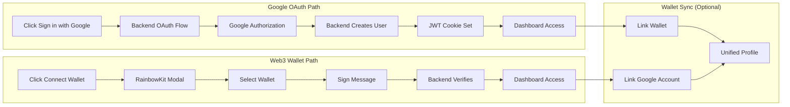

# Dual Authentication System (The Onramp)

> **As a user**, I can log in using my Google account or connect my Web3 wallet, with the option to link both for a unified profile.

---

## Overview

The CrowdFUNding platform employs a **dual authentication strategy** that accommodates both traditional Web2 users and crypto-native Web3 users. This approach eliminates barriers while respecting user preferences and technical sophistication levels.

**Google OAuth 2.0** provides familiar social login for mainstream users, while **RainbowKit** enables Web3 wallet connections for crypto enthusiasts. Users can also link their wallet to their Google account for a unified experience.

Traditional blockchain onboarding requires wallet extensions, seed phrase storage, gas fee understanding, and unfamiliar interfaces—causing 95% drop-off in Web3 user acquisition. Our dual authentication system removes these friction points while still supporting self-custodial wallets.

### What It Solves

1. **Onboarding Friction**: Traditional Web3 onboarding requires 6-8 steps including wallet installation, seed phrase backup, and initial funding. Research shows 80% of users abandon at the seed phrase step alone. Google OAuth reduces this to a single login click.

2. **Mass Adoption Barrier**: Indonesia has 67M+ users comfortable with digital payments (QRIS, GoPay, OVO), yet less than 5% have used blockchain. The barrier isn't interest—it's complexity. By offering familiar Google login alongside Web3 wallets, we unlock this massive user base.

3. **Flexibility & Choice**: Crypto-native users can use their existing wallets (MetaMask, Coinbase Wallet, etc.) while new users can start with Google and add a wallet later when they're ready.

---

## Technical Flow

The following diagram illustrates the dual authentication paths available to users:

### Google OAuth Flow (Server-Side)

1. **Authentication Initiation**: User clicks "Sign in with Google" button
2. **Backend Redirect**: Frontend redirects to `/auth/google` endpoint
3. **OAuth Authorization**: Backend (Passport.js) handles OAuth with Google
4. **User Creation**: Backend creates/updates user in PostgreSQL
5. **Session Establishment**: JWT token set in httpOnly cookie
6. **Dashboard Access**: User redirected to frontend with active session

### Web3 Wallet Flow (Client-Side)

1. **Wallet Connection**: User clicks "Connect Wallet" button
2. **RainbowKit Modal**: User selects from 100+ supported wallets
3. **Wallet Authorization**: User approves connection in wallet
4. **Message Signing**: User signs authentication message
5. **Backend Verification**: Backend verifies signature and creates/finds user
6. **Dashboard Access**: User gains access with wallet address as identifier

### Technical Components

The table below details the core technologies powering our dual authentication system:

| Component              | Technology                     | Purpose                                             |
| ---------------------- | ------------------------------ | --------------------------------------------------- |
| **Social Auth**        | Google OAuth 2.0 + Passport.js | Server-side OAuth flow for Google login             |
| **Wallet Connection**  | RainbowKit + Wagmi             | Client-side wallet connection UI and hooks          |
| **Session Management** | JWT (httpOnly cookies)         | Secure, stateless authentication                    |
| **User Storage**       | PostgreSQL (Supabase)          | Stores user profiles, wallet addresses, sync status |
| **Wallet Signing**     | Viem                           | Message signing and verification                    |

---

## Comparison with Traditional Onboarding

The following comparison demonstrates the reduction in complexity:

| Metric                     | Traditional Web3 | Google OAuth | Web3 Wallet (Our Impl) |
| -------------------------- | ---------------- | ------------ | ---------------------- |
| **Time to First Action**   | 10-15 minutes    | 30 seconds   | 1-2 minutes            |
| **Steps Required**         | 6-8 steps        | 2 steps      | 3 steps                |
| **Seed Phrase Management** | Required         | Not Required | User's responsibility  |
| **Wallet Installation**    | Required         | Not Required | Optional               |
| **Technical Knowledge**    | High             | None         | Medium                 |
| **Self-Custody**           | Yes              | No           | Yes                    |
| **Target Audience**        | Crypto-native    | Everyone     | Crypto users           |

---

## Why It Matters

By offering **both** authentication methods, CrowdFUNding ensures that anyone—from a university student to a DeFi power user—can participate without technical hurdles or forcing them away from self-custody.

### Key Benefits

1. **Zero Friction for Newcomers**: Google OAuth provides instant access without blockchain knowledge
2. **Respects Self-Custody**: Crypto users can bring their own wallets
3. **Flexible Linking**: Users can link wallet to Google account for unified profile
4. **Secure Sessions**: Server-side OAuth with JWT cookies (no local storage vulnerabilities)
5. **No Vendor Lock-in**: No reliance on third-party wallet providers

### Authentication Options Comparison

| Feature              | Google OAuth Only | Wallet Only | Our Dual System |
| -------------------- | ----------------- | ----------- | --------------- |
| **Accessibility**    | High              | Low         | High            |
| **Self-Custody**     | No                | Yes         | Optional        |
| **Onboarding Speed** | Fastest           | Slow        | Flexible        |
| **User Choice**      | Limited           | Limited     | Maximum         |
| **Target Market**    | 100%              | 5%          | 100%            |

---

## Related Implementation

**Backend (Passport.js)**: Handles Google OAuth strategy, user creation, JWT generation

- File: `be/controllers/authController.ts`
- Routes: `/auth/google`, `/auth/google/callback`

**Frontend (RainbowKit)**: Provides wallet connection UI

- Component: `<ConnectButton />` from `@rainbow-me/rainbowkit`
- Hooks: `useAccount`, `useConnect`, `useSignMessage` from `wagmi`

**Wallet Sync**: Optional linking between Google account and wallet

- API: `/check-wallet-sync`, `/sync-wallet`
- Component: `<SyncConfirmModal />`
