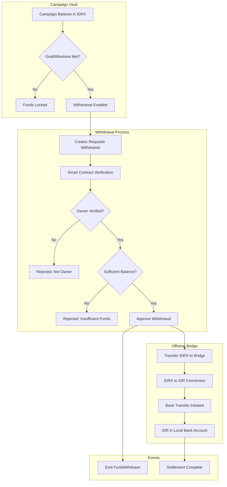

# Automated Bank Settlement (The Offramp)

> **As a campaign creator**, I can have IDRX funds sent directly from the Campaign Vault to my local bank account in Rupiah, ensuring the money is ready for real-world use.

---

## Overview

Automated Settlement solves the "last mile" problem by enabling off-ramping of IDRX directly to local bank accounts in Indonesian Rupiah. The smart contract enforces ownership verification, balance checks, and reentrancy protection—replacing trust-based platform approval with code-based verification.

Blockchain transparency means nothing if campaign creators cannot use funds to purchase medicine or building materials. By providing seamless conversion from on-chain IDRX to bank-deposited IDR, we complete the circle from digital donation to real-world impact.

### What It Solves

1. **Last Mile Problem**: Cryptocurrency is useless if it cannot buy rice or medicine. Many blockchain charity initiatives have failed here—either requiring campaign creators to understand crypto exchanges or leaving funds stranded. Automated Settlement provides a one-click path from on-chain value to bank-deposited Rupiah.

2. **Trust and Misuse**: Traditional crowdfunding relies on manual review processes that are slow, inconsistent, and have failed numerous times (176 Indonesian philanthropic entities investigated by PPATK). Smart contract settlement enforces rules mathematically—only the registered owner can withdraw, and only the available balance.

3. **Recipient Complexity**: Campaign creators are focused on their cause—disaster relief, medical treatment, community development—not cryptocurrency mechanics. Requiring them to understand wallet management, gas fees, and exchange trading would exclude many who most need these tools. The offramp abstracts all complexity behind a simple interface.

---

## Technical Flow

The following diagram traces the complete withdrawal process from the decision to withdraw through final bank settlement. Note the multiple security checkpoints that must all pass before funds are released:



The process enforces security at multiple layers:

**Layer 1 - Milestone Verification**: Optionally, withdrawals can be gated behind campaign milestones (reaching funding goals, providing impact updates). This is handled by the frontend/backend and is separate from the smart contract logic.

**Layer 2 - Ownership Verification**: The smart contract verifies that `msg.sender` matches the `campaign.owner` address. This cryptographic check cannot be bypassed or overridden.

**Layer 3 - Balance Validation**: The requested withdrawal amount is checked against the available campaign balance. Overdraw attempts are rejected with a specific error.

**Layer 4 - Secure Transfer**: The actual token transfer uses OpenZeppelin's SafeERC20 library, which verifies the transfer succeeded before proceeding.

**Layer 5 - Audit Trail**: Every successful withdrawal emits a FundWithdrawn event, creating a permanent, queryable record on the blockchain.

### Smart Contract Integration

The following code shows the withdrawal function that campaign creators call to claim their funds. Note the security checks at the beginning and the event emission for transparency:

```solidity
// Campaign.sol - Withdrawal function
function withdraw(uint256 campaignId, uint256 amount) public nonReentrant {
    CampaignStruct storage campaign = _campaigns[campaignId];

    // Security checks
    if (campaign.owner != msg.sender) revert OnlyOwnerCanWithdraw(msg.sender);
    if (amount > campaign.balance) revert InsufficientBalance(amount, campaign.balance);

    // Execute withdrawal
    campaign.balance -= amount;

    // Transfer storageToken (IDRX) to owner
    bool success = IERC20(storageToken).transfer(msg.sender, amount);
    if (!success) revert WithdrawalFailed(msg.sender, campaign.name, amount);

    emit FundWithdrawn(campaignId, campaign.name, msg.sender, campaign.creatorName, amount);
}
```

The `nonReentrant` modifier prevents reentrancy attacks—a class of exploits where malicious code could call the withdraw function repeatedly before the balance update is finalized. This protection is critical for any function that transfers value.

### Technical Components

The following table describes each component in the settlement pipeline and its role in ensuring secure, transparent fund disbursement:

| Component            | Technology                | Purpose                                                                |
| -------------------- | ------------------------- | ---------------------------------------------------------------------- |
| **Access Control**   | Solidity ownership check  | Ensures only campaign.owner address can initiate withdrawals           |
| **Balance Check**    | On-chain state comparison | Prevents withdrawal requests exceeding available funds                 |
| **Reentrancy Guard** | OpenZeppelin modifier     | Blocks exploit attempts that could drain funds through recursive calls |
| **IDRX Transfer**    | SafeERC20 library         | Executes secure token transfer with success verification               |
| **Offramp Bridge**   | IDRX Partner API          | Converts on-chain IDRX to fiat IDR for bank transfer                   |
| **Bank Transfer**    | Banking API integration   | Completes final settlement to campaign creator's bank account          |

---

## Settlement Security Model

The following diagram illustrates the multiple security layers that protect campaign funds from unauthorized or erroneous withdrawals:

```
+------------------------------------------------------------------+
|                    Multi-Layer Security                          |
+------------------------------------------------------------------+
|                                                                  |
|   Layer 1: Ownership Verification                                |
|   Description: Only campaign.owner can call withdraw()           |
|   Enforcement: Solidity require statement with revert            |
|                                                                  |
|   Layer 2: Balance Validation                                    |
|   Description: amount must be <= campaign.balance                |
|   Enforcement: Comparison check with custom error                |
|                                                                  |
|   Layer 3: Reentrancy Protection                                 |
|   Description: Blocks recursive call exploits                    |
|   Enforcement: OpenZeppelin ReentrancyGuard modifier             |
|                                                                  |
|   Layer 4: Safe Token Transfer                                   |
|   Description: Verifies transfer succeeded                       |
|   Enforcement: SafeERC20.safeTransfer() with success check       |
|                                                                  |
|   Layer 5: Event Logging                                         |
|   Description: Creates immutable audit trail                     |
|   Enforcement: FundWithdrawn event emission                      |
|                                                                  |
+------------------------------------------------------------------+
```

This defense-in-depth approach ensures that even if one security layer were somehow bypassed, subsequent layers would prevent fund loss. The architecture follows established smart contract security best practices from OpenZeppelin and has been validated against common attack vectors.

---

## Comparison with Traditional Fund Disbursement

The following table compares Automated Settlement against conventional fund disbursement methods used by banks and payment platforms. Processing times and fees are based on published rates from major providers:

| Metric                 | Bank Escrow            | PayPal/Stripe        | CrowdFUNding (Smart Contract) |
| ---------------------- | ---------------------- | -------------------- | ----------------------------- |
| **Disbursement Time**  | 5-14 business days     | 1-5 business days    | Instant to IDRX               |
| **Withdrawal Fee**     | 2-5%                   | 2.9% + fixed fee     | Rp 5,000 flat                 |
| **Minimum Withdrawal** | Often $100+            | $25+                 | No minimum                    |
| **Approval Process**   | Manual review required | Automated but opaque | Transparent smart contract    |
| **Audit Trail**        | Internal records only  | Platform-specific    | Public blockchain             |
| **Fund Security**      | Trust the bank         | Trust the platform   | Trustless code enforcement    |

The most significant advantage is the replacement of trust-based approval with code-based verification. Traditional platforms can freeze funds, delay disbursements, or require additional documentation at their discretion. The smart contract executes invariably—if the owner requests a withdrawal and has sufficient balance, the withdrawal proceeds.

---

## Competitive Advantage

The following comparison focuses on Indonesian crowdfunding platforms and their withdrawal processes:

| Feature                 | Kitabisa            | BenihBaik           | CrowdFUNding               |
| ----------------------- | ------------------- | ------------------- | -------------------------- |
| **Withdrawal Fee**      | Rp 2,500 - 4,000    | Rp 4,500 - 6,500    | Rp 5,000 (comparable)      |
| **Processing Time**     | 3-5 business days   | Batch (weekly)      | Instant IDRX, same-day IDR |
| **Transparency**        | Internal audit only | Internal audit only | On-chain verifiable        |
| **Fund Lock Mechanism** | Platform discretion | Platform discretion | Smart contract enforced    |
| **Partial Withdrawals** | Limited options     | Restricted          | Fully flexible             |
| **Real-time Balance**   | Dashboard display   | Dashboard display   | Blockchain explorer        |

While the withdrawal fee is comparable across platforms, CrowdFUNding offers significant advantages in processing speed and transparency. The combination of instant on-chain availability with same-day bank settlement eliminates the multiday waiting periods common on traditional platforms.

---

## Why It Matters

The Automated Settlement feature completes the loop—ensuring that while technology is "Onchain," impact is strictly "Real World," settling in the currency that local vendors accept.

### Key Benefits

1. **Real-World Utility**: Funds are usable immediately for actual expenses—medicine, construction materials, food supplies, emergency aid. Campaign creators can pay vendors without any cryptocurrency knowledge.

2. **Trust Through Code**: Smart contract conditions prevent premature or unauthorized withdrawals. Unlike traditional platforms where policies can change, the code executes the same way every time.

3. **Full Transparency**: Every withdrawal is recorded on the Base blockchain with timestamps, amounts, and addresses. Donors can verify that funds reached the campaign creator.

4. **No Platform Lock-in**: Funds flow to standard Indonesian bank accounts, not platform-specific wallets. Campaign creators maintain full control once withdrawn.

5. **Instant Liquidity**: No arbitrary "processing" or "review" period. If smart contract conditions are met, withdrawal proceeds immediately—critical for emergencies.

### Security Guarantees

The following table summarizes the security guarantees provided by the smart contract withdrawal function:

| Guarantee                   | Implementation                       | Failure Mode                                        |
| --------------------------- | ------------------------------------ | --------------------------------------------------- |
| **Only owner can withdraw** | `campaign.owner != msg.sender` check | Transaction reverts with OnlyOwnerCanWithdraw error |
| **Cannot overdraw**         | `amount > campaign.balance` check    | Transaction reverts with InsufficientBalance error  |
| **Atomic transactions**     | Single transaction execution         | All-or-nothing—no partial states possible           |
| **Attack prevention**       | ReentrancyGuard modifier             | Recursive calls blocked at function entry           |
| **Transfer verification**   | SafeERC20 success check              | Failed transfers revert with WithdrawalFailed error |

### Impact Metrics

The following metrics demonstrate the improvement in fund availability when using Automated Settlement compared to traditional crowdfunding withdrawal processes:

| Metric                    | Traditional Platforms   | CrowdFUNding        |
| ------------------------- | ----------------------- | ------------------- |
| **Time to Bank Account**  | 5-14 business days      | Less than 24 hours  |
| **Total Withdrawal Cost** | 3-7%                    | Less than Rp 10,000 |
| **Transparency Score**    | Low (manual audits)     | 100% (on-chain)     |
| **Fund Misuse Risk**      | Medium (platform trust) | Low (code-enforced) |

---

## Related Smart Contracts

The Automated Settlement feature is implemented through the following deployed contracts:

**Campaign.sol** (0x44e87aa98d721Dbcf368690bF5aAb1F3dD944dA9): The core contract containing withdrawal logic. Key functions include:

- `withdraw(campaignId, amount)`: Withdraws IDRX to the campaign owner's wallet
- `withdraw(campaignId, amount, tokenIn)`: Alternative function for withdrawing specific ERC20 tokens
- `getCampaignInfo(campaignId)`: Query function to check current balance and ownership

**MockIDRX.sol** (0x387551ac55Bb6949d44715D07880f8c6260934B6): The IDRX token that is transferred during withdrawals. Campaign balances are denominated in this token.

### Event Signature

The FundWithdrawn event provides complete audit trail information for every withdrawal:

```solidity
event FundWithdrawn(
    uint256 indexed campaignId,
    string name,
    address indexed owner,
    string creatorName,
    uint256 amount
);
```

This event enables several important functions:

- **Real-time Notifications**: Backend services can listen for this event to trigger user notifications
- **Public Verification**: Anyone can query the blockchain for all FundWithdrawn events to verify fund disbursement
- **Accounting Integration**: The structured data format allows automated import into accounting systems
- **Transparency Reports**: Aggregate analysis of withdrawal patterns supports platform-wide transparency reporting
